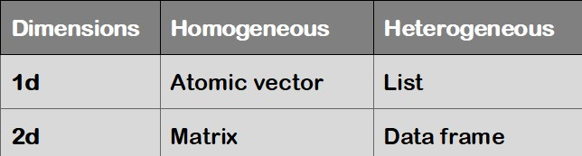

# Introduction to R 

## R Language

R is a complete programming language and software environment for statistical computing and graphical representation.
As part of the GNU Project (free software, mass collaboration project), the source code is free available.
Its functionalities can be expanded by importing packages.
For more details on R see <https://www.r-project.org/>.

### R Packages

A package is a file generally composed of R scripts (e.g., functions).
On all operation systems the function "install.packages()" can be used to download and install a package automatically.
Otherwise, a package already installed in R can be loaded in a session by using the command \textcolor{red}{library(package_name)}.
In R, the directories where the packages are stored are called "libraries". The terms "package" and "library" are sometimes used synonymously.
For example, to check the list of the installed packeges, the function \textcolor{red}{library()} can be used.
When you open an **R Markdown** document (.Rmd) the program propose you automatically to install the libraries listed there.

### Some tips

-   R is case sensitive!
-   Previously used command can be recalled in the console by using the *up arrow* on the keyboard.
-   The working directory by default is "*C:/user/.../Documents*".
    -   It can be found using the command \textcolor{red}{getwd()}
    -   It can be changed using the command line \textcolor{red}{setwd("C:/Your/own/path")}
-   In **R Markdown**: the working directory when evaluating R code chunks is the directory of the input document by default.
    -   To access to a specific file in a sub-folder use ". /subfolder/file.ext"
    -   To access to a specific file in a up-folder use ". . /upfolder/file.ext"

### R Commands (online resources)

Many table resuming the main R commands can be found online.
Here some useful links:

-   [A short list of the most useful R commands](https://www.maths.usyd.edu.au/u/jchan/Rcommands.pdf)

-   [Table of Useful R commands](https://sites.calvin.edu/scofield/courses/m143/materials/RcmdsFromClass.pdf)

-   [Basic Commands to Get Started with R](https://rpubs.com/ssammut/ResearchStats)

## R Markdown

This is an R Markdown document :-)

Markdown is a simple formatting syntax for authoring HTML, PDF, and MS Word documents.
It is a simple and easy to use **plain text language** allowing to combine R code, results from data analysis (including plots and tables), and comments  into a single nicely formatted and *reproducible* document (like a report, publication, thesis chapter or web pages).

Code lines are organized into code blocks, seeking to solve specified tasks, and referred to as **"code chunk"**.
For more details on using R Markdown see <http://rmarkdown.rstudio.com>.

All what you have to do during the computing labs is to read each explanatory paragraph before running each individual R code chunk, one by one, and to interpret the results.
Finally, to create a personal document (usually a PDF) from rmarkdown, you need to **Knit** the document.
Knitting a document simply means taking all the text and code and creating a nicely formatted document.

## Data type in computational analysis

### Variables

Variables are used to store values in a computer program.
Values can be numbers (real and complex), words (string), matrices, and even tables.

The fundamental or atomic data in R Programming can be:

-   **integer**: number without decimals
-   **numeric**: number with decimals (*float* or *double* depending on the precision)
-   **character**: string, label
-   **factors**: a label with a limited number of categories
-   **logical**: true/false

```{r img1, fig.cap="Data Types in R \\label{data_Type}", dpi=300, out.width="100%", out.height="80%", fig.align="center", echo = FALSE}
# knitr::include_graphics("Different-Data-Types-in-R-Programming.jpg")
knitr::include_graphics("images/Rvariablesdata.jpg")
```

\newpage

### Data structure in R

R's base data structures can be organised by their dimensionality (1d, 2d, or nd) and whether they are homogeneous (all contents must be of the same type) or heterogeneous (the contents can be of different types).

This gives rise to the four data structures most often used in data analysis:

```{r img2, fig.cap="Data structures in R \\label{data_str}", dpi=300, out.width="50%", out.height="60%", fig.align="center", echo = FALSE}
# knitr::include_graphics("Different-Data-Types-in-R-Programming.jpg")

```

A **Vector** is a one-dimensional structure winch can contain object of one type only: numerical (integer and double), character, and logical.

```{r vector1}
# Investigate vector's types:

v1 <- c(0.5, 0.7); v1; typeof(v1)

v2 <-c(1:10); v2; typeof(v2)

v3 <- c(TRUE, FALSE); v3; typeof(v3)

v4 <- c("Swiss", "Itay", "France", "Germany"); v4; typeof(v4)
```

```{r vector2}
#Create a sequence from 0 to 5 with a step of 0.5:

v5 <- seq(1, 5, by=0.5); v5; typeof(v5)

length(v5)

summary(v5)
```

```{r vector3}
#Extract the third element of the vector
v5[3]

#Exclude the third element from the vector and save as new vector
v5[-3]
w5<-v5[-3]; w5

```

A **Matrix** is a two-dimensional structure winch can contain object of one type only.
The function \textcolor{red}{matrix()} can be used to construct matrices with specific dimensions.

```{r matrix}

# Matrix of elements equal to "zero" and dimension 2x5 
m1<-matrix(0,2,5); m1  #(two rows by five columns)

# Matrix of integer elements (1 to 12, 3x4) 
m2<-matrix(1:12, 3,4); m2 

# Extract the second row
m2[2, ]
# Extract the third column
m2[,3]
# Extract the the second element of the third column
m2[2,3]
```

### Data Frame

A **data frame** allows to collect data of different type.
All elements must have the same length.

A **list** is a more flexible structure since it can contain variables of different types and lengths.
Nevertheless, the preferred structure for statistical analyses and computation is the data frame.

It is a good practice to explore the data frame before performing further computation on the data.
This can be simply accomplished by using the commands \textcolor{red}{str} to explore the structure of the data and \textcolor{red}{summary} to display the summary statistics and quickly summarize the data.
For numerical vectors the command \textcolor{red}{hist()} can be used to plot the basic histogram of the given values.

```{r define-vectors}
# Create the vectors with the variables

cities <- c("Berlin", "New York", "Paris", "Tokyo")
area <- c(892, 1214, 105, 2188)
population <- c(3.4, 8.1, 2.1, 12.9)
continent <- c("Europe", "Norh America", "Europe", "Asia")
```

```{r data-frame}
# Concatenate the vectors into a new data frame
df1 <- data.frame(cities, area, population, continent)
df1

#Add a column (e.g., language spoken) using the command "cbind"
df2 <- cbind (df1, "Language" = c ("German", "English", "Freanch", "Japanese"))
df2
```

```{r data-frame3}
#Explore the data frame
str(df2) # see the structure
summary(df2) # compute basic statistics

# Use the symbol "$" to address a particular column
pop<-(df2$population)
pop
hist(pop) # plot the histogram
```
