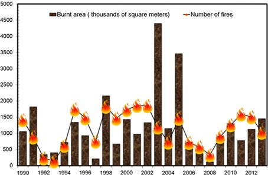

```{r  global-options, include=FALSE}
knitr::opts_chunk$set(message = FALSE, warning = FALSE, fig.align="center")

```

# Geographically Weighted Summary Statistics in Geosciences

Geographically Weighted Summary Statistics (GWSS) represent an advanced analytical approach in geoscience, allowing researchers to explore spatial variations in data across a geographical landscape.
Unlike traditional summary statistics that provide a single, overall summary measure (like mean, median, or standard deviation) for an entire dataset, GWSS techniques calculate these measures locally, reflecting the unique characteristics and variations at different spatial locations.
This method is particularly valuable in geoscience, where spatial heterogeneity often plays a critical role.

## GWSS for fire management

In fire risk assessment, it is essential to identify areas where fires occur most frequently and differentiate between small and large fires.
This information is critical for understanding ignition factors and developing strategies to reduce forest fires, manage ignition sources, and identify high-risk areas.

Although spatio-temporal inventories of forest fires are available, extracting meaningful insights about their distribution patterns remains challenging when relying solely on the examination of mapped burnt areas.
To address this, Geographically Weighted Summary Statistics (GWSS) can be utilized.
GWSS assumes that burned areas exhibit geographic trends and calculates local statistics to reveal these patterns more clearly.
This approach provides valuable insights for effective fire management and prevention strategies.

We compute here the GW local means, the GW local standard deviation and the GW localized skewness of burned areas in continental Portugal, registered in the period 1990-2013.
This application is inspired by the work of [@tonini_evolution_2017]

### The overall methodology

**Summary statistics** include a number of measures that can be used to summarize a set of observations, the most important of which are measures of central tendency (arithmetic mean, median and mode) and measures of dispersion around the mean (variance and standard deviation).
In addition, measures of skewness and kurtosis are descriptors of the shape of the probability distribution function, the former indicating the asymmetry and the latter the peakedness/tailedness of the curve.

For geoenvironmental processes, these global statistical descriptors may vary from one region to another, as their values may be affected by local environmental and socio-economic factors.
In this case, an appropriately localized calibration can provide a better description of the observed values.
One way to achieve this goal is to weight the above statistical measures for a given quantitative variable based on their geographical location.

We introduce here the method proposed by [@brunsdon_geographically_2002] and implemented in the **function GWSS** presented in the R package GWmodel [@lu_gwmodel_2014; @brunsdon_rpubs_2019].

The evaluation of geographically weighted summary statistics is obtained by computing a summary for a small area around each geolocalized punctual observation, by using the kernel density estimation technique (KDE) [@brunsdon_estimating_1995].
KDE is estimated at each point, taking into account the influence of the points falling within an area, with increasing weight towards the center, corresponding to the point location.
A surface summary statistic is thus obtained.

### Forest fires dataset

Forest fires inventories indicating the location, the starting date and other related variables, such as the cause of ignition and the size of the area burned, are broadly available with a different degree of accuracy in different countries.

In the present study, we consider the Portuguese National Mapping Burnt Areas dataset , freely available from the website of the Institute for the Conservation of Nature and Forests, ICNF (<https://www.icnf.pt/florestas/gfr/gfrgestaoinformacao/dfciinformacaocartografica>).
This is a long spatio-temporal dataset (from 1975) resulting from the processing of satellite images acquired once a year at the end of the summer season.
Row data consist of records of observed fire scars.
The burned areas were estimated by using image classification techniques, then compared with ground data to resolve the discrepancies.
Polygons have been converted into point shapefile, where each point represent the centroid of the burned areas, while the size of the burned areas and the starting date of the fires events are given as attributes.

In this work, for consistency reasons, we consider only fires occurred between 1990 and 2013 and with a burned area above 5 hectares.
\autoref{Histo_FF}.

```{r jpg, fig.cap="Total annual number of forest fire events, expressed in thousands of square metres \\label{Histo_FF}", dpi=300, out.width="70%", out.height="70%", fig.align="center", echo = FALSE}

```

## Computing lab: GWSS

### Load the libraries

First you have to load the following libraries:

-   **splancs**: for display and analysis of spatial point pattern data
-   **GWmodel**: techniques from a particular branch of spatial statistics, termed geographically-weighted (GW) models
-   **sf**: support for simple features, a standardized way to encode spatial vector data
-   **ggplot2**: a system for 'declaratively' creating graphics
-   **sp**: classes and methods for spatial data

```{r libs-loaded}

library(splancs)
library(GWmodel)
library(sf)
library(ggplot2)
library(sp)

(.packages())

```

### Import the forest fire dataset

In this section you will load the geodata representing the forest fires inventories for events occurred in the continental Portuguese area in the period 1990-2013.
You will also load the boundaries of the study area.
You will start by exploring the datasets using mainly visual tools (plotting and histogram).

```{r import-data, results = FALSE}

# Import Portugal boundary 
Portugal <- st_read("data/GWSS/Area_Portugal.shp")

# Import the Portuguese forest fires dataset for the entire Portuguese area.
FFPorto<-st_read("data/GWSS/FF_Portugal.shp")
```

You can explore the dataset by using different tools for **exploratory data analyses**.
You will start by visualizing the databases.
In the GIS environment, this correspond to the attribute table of a vector punctual feature.

Than you can plot the histogram of events distribution based on the variable *"Area_ha"* (the size in hectares of the burned area).
Since this is a power low distribution, for a better understanding it is recommended to transform the data using a logarithmic scale.
Using Log10 you can easily evaluate the frequency distribution of the burned areas.

```{r ESDA.FF, results = FALSE}

# Show the attribute table (first 10 rows) 
FFPorto 

# Open the attribute table in a new tab 
View(FFPorto) 

# Summary statistics of all of the attributes associated with this dataset
summary(FFPorto$Area_ha)
```

```{r histo_FF}

# Display the histogram of burned area distribution
hist(FFPorto$Area_ha)
hist(log10(FFPorto$Area_ha))
```

### Forest fires spatial distribution

For a better understanding of the phenomenon, you can group the events according to the size of the burned area.
Based on the frequency distribution of the burned areas, the following three classes can be defined:

-   **Small fires**: less than 15 ha
-   **Medium fires**: between 15 ha and 100 ha
-   **Large fires**: bigger than 100 ha

Plotting the forest fires events using different colors, based on the size of the burned areas, can simplify the understanding of their pattern distribution, knowing that fires of different size have normally different drivers.

```{r plot-all-fires, echo=FALSE}

ggplot() + 
  geom_sf(data=Portugal)+
  geom_sf (data = FFPorto, aes(colour = cut(Area_ha, c(-Inf, 15, 100, Inf))), size=0.5) +
  scale_color_manual(name = "Area_ha", 
                     values = c("(-Inf,15]" = "black",
                                "(15,100]" = "yellow",
                                "(100, Inf]" = "red"),
                     labels = c("<= 15", "15-100", "> 100"),
                       ggtitle("Forest fires in Portugal", subtitle = "1990-2013")) + 
    coord_sf()

```

### Compute the geographically weighted statistics

From the exploratory data analysis performed above, it seems that a simple plotting of the forest fires events based on their spatial distribution, even if classified based on their size, can not really help to understand their behaviors.
This is because we face to a huge number of events and the variable that we are using to characterize them (i.e., the size of the burned area) is very heterogeneous.
To this aim, we can compute basic and robust GWSS and plot the data accordingly.

GWSS includes *geographically weighted means*, *standard deviations* and the *skweness*.
As you can see from the R Documentation - command: `help(gwss)` - same data manipulations are necessary to transform the forest fires dataset into a compatible data frame format.

```{r gwss-input, results = FALSE}

# Transform inputs data into a spatial points data frame
FFdf<-data.frame(X=FFPorto$X, Y=FFPorto$Y, Area=FFPorto$Area_ha)
FFspdf<-SpatialPointsDataFrame(FFdf[,1:2], FFdf)
str(FFspdf)
```

**GWSS parameters**:

-   We summarize the data based on the size of the burned area (*vars*).
-   We use here an adaptive kernel where the bandwidth (*bw*) corresponds to the number (100 in this case) of nearest neighbors (i.e. adaptive distance).
-   We keep the default values for the other parameters.

```{r run-gwss}

# Run gwss: this operation can take several minutes...be patient!
# While waiting, you can look at gwss R Documentation:
help(gwss)

FFgwss <- gwss(FFspdf,vars=("Area"),adaptive=TRUE, bw=100)
```

### Look at the results

The resulting object (*FFgwss*) has a number of components.
The most important one is the spatial data frame containing the results of local summary statistics for each data point location, stored in *FFgwss\$SDF* (that is a spatial data frame).

```{r gwss-results, results = FALSE}

# display the first 6 rows
head(FFgwss$SDF) 

# Inspect the resulting object 
FFgwss
```

### GWSS maps

To produce a map of the local geographically weighted summary statistic of your choice, firstly we need to enter a small R function definition.
This is just a short R program to draw a map: you can think of it as a command that tells R how to draw a map (see [Geographically Weighted Summary Statistics in Geosciences] (<https://rpubs.com/chrisbrunsdon/99667>) for more details).
The advantage of defining a function is that the entire map can now be drawn using a single command for each variable, rather than having to repeat those steps each time.
To define the intervals for the classification, we use Jenks natural breaks classification method (`style="fisher"`).

```{r gwss-maps}

library(RColorBrewer) #a useful tool for designing map color palettes.
library(classInt) #to define class intervals

# The function definition to draw the map:

quick.map <- function(spdf,var,legend.title,main.title) {
  x <- spdf@data[,var]
  int <- classIntervals(x, n=5, style="fisher")
  cut.vals<-int$brks
  x.cut <- cut(x,cut.vals)
  cut.levels <- levels(x.cut)
  cut.band <- match(x.cut,cut.levels)
  colors <- rev(brewer.pal(length(cut.levels), "RdYlGn"))
  par(mar=c(1,1,1,1))
  plot(Portugal$geometry,col='lightgrey')
  title(main.title)
  plot(spdf,add=TRUE,col=colors[cut.band],pch=16, cex=0.5)
  legend("bottomright",cut.levels,col=colors,pch=16,bty="n",title=legend.title)
  }

# Call the function to display the maps of the Local Mean (LM), Local Standard Deviation(LS), and Local Skweness (LSKe)

par(mfrow=c(1,3))
quick.map(FFgwss$SDF, "Area_LM", "Area (ha)", "GWL Means")
quick.map(FFgwss$SDF, "Area_LSD", "Area (ha)", "GWL Standard Deviation")
quick.map(FFgwss$SDF, "Area_LSKe", "Area (ha)", "GWL Skewness")
```

## Conclusions and further analyses

This practical computer lab allowed you to familiarize with GWSS, by the proposed application about geographically weighted summary statistics.
This method allowed us to explore how the average burned area vary locally through Continental Portugal in the period 1990-2013.

The global Geographically Weighted (GW) means informs us about the local average value of the burned area, based of the neighboring events occurred in a given period.
Similarly, you may compute the GW standard deviation to see the extent to which the size of the burned area spread around this mean.
Finally you can compute the GW skewness to measure the symmetry of distribution: a positively skewed distribution means that there is a higher number of data points with low values, with mean value lower that the median; and the contrary for a negatively skewed distribution.

To ensure that everything is perfectly clear, we propose you to answer the following questions.
You can find the answers in the reference paper [@tonini_evolution_2017].

1)  What is the pattern distribution of the GW-means for burned area in Portugal during the investigated periods?

2)  Does the GW-standard deviation follows the same pattern?
    How can you interpret the two pattern in terms of burned area and their characterization?

3)  GW-skewness has positive values everywhere: what does it means?
    What do these values suggest to be the distribution of the burned areas, in terms of their size, around the local means?

4)  Which can be other applications of GWSS for geo-environmental data?
    In other words, can you imagine other geo-environmental dataset that can be analysed using GWSS?

5)  You can finally play with the code and try to run it using a different numbers of nearest neighbors (*bw=x*) and compare the results.
