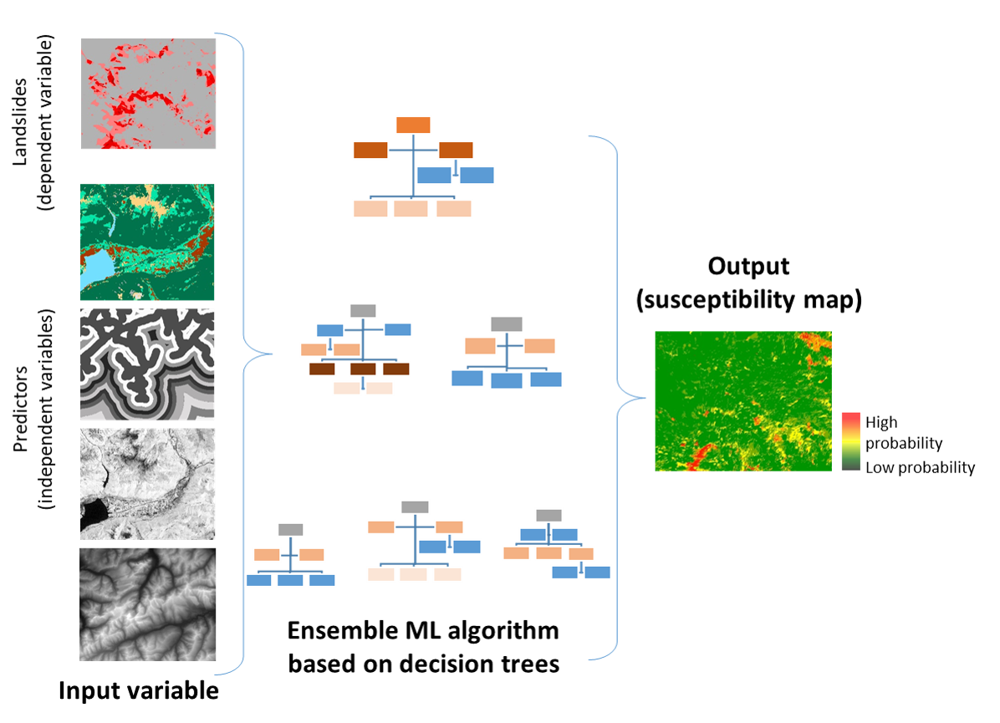

# Random Forest

```{r  global-options, echo=FALSE, warning=FALSE}
knitr::opts_chunk$set(message = FALSE, warning = FALSE)
```

## Introduction

In this application, we explore the capabilities of a stochastic approach based on a machine learning (ML) algorithm to elaborate landslides susceptibility mapping in Canton Vaud, Switzerland.
Generally speaking, ML includes a class of algorithms for the analysis, modelling, and visualization of environmental data and it performs particularly well to model environmental hazards, which naturally have a complex and non-linear behavior.
Here we use Random Forest, an ensemble ML algorithm based on decision trees.

The research framework that inspired this computational lab refers to a pioneering study in susceptibility mapping for wildfire eventy by @tonini_machine_2020 and further developed for the assessment of variable importance by @trucchia_machine-learning_2022.

### The main objective

Landslides are one of the major hazard occurring around the world.
In Switzerland, landslides cause damages to infrastructures and sometimes threaten human lives.
Shallow landslides are triggered by intense rainfalls.
Such slope movements are generally very rapid and hardly predictable.
Different quantitative approaches have been developed to assess the most susceptible areas.

This project applies a data-driven methodology based on Random Forest (RF) (@breiman_random_2001) to elaborate the landslides susceptibility map of canton of Vaud, in Switzerland.
RF is applied to a set of independent variables (i.e., the predictors) and dependent variables (the inventoried landslides and an equal number of locations for absences).
The overall methodology is described in the following graphic (\autoref{Methodology}).

```{r gen-met, fig.cap="Basic elements of the generic methodology \\label{Methodology}", dpi=300, out.width="80%", out.height="80%", fig.align="center", echo = FALSE}

```

### Load the libraries

To perform the analysis, you have first to install the following libraries:

-   **library(raster)**: The raster package provides classes and functions to manipulate geographic (spatial) data in 'raster' format.

-   **library(readr)**: The goal of 'readr' is to provide a fast and friendly way to read rectangular data (like 'csv', 'tsv', and 'fwf').

-   **library(randomForest)**: Classification and regression based on a forest of trees using random inputs, based on [Breiman (2001)](https://link.springer.com/article/10.1023/A:1010933404324).

-   **library(dplyr)**: It is the next iteration of plyr, focused on tools for working with data frames (hence the d in the name).

-   **library(pROC)**: Allowing to compute, analyze ROC curves, and

    -   **library(plotROC)** to display ROC curve

-   **(ggplot2)**: Is a system for declaratively creating graphics.

-   **library(sf)**: Support for simple features, a standardized way to encode spatial vector data.

```{r libs-loaded, message = FALSE, warning = FALSE}
library(raster) 
library(readr) 
library(randomForest)
library(dplyr) 
library(pROC) 
library(plotROC) 
library(ggplot2)  
library(sf) 
library(classInt)

(.packages())

```

**List of the libraries**

## Import the data

Import the **landslides punctual dataset** presences and pseudo-absences (LS_pa) and *predictors* (in raster format).
This help the exploratory data analyses steps and to understand the input data structure.

### Landslides dataset

The **landslide inventory** has been provided by the environmental office of the canton of Vaud.
Only *shallow landslides* are used for susceptibility modelling.
One pixel per landslide-area (namely the one located at the highest elevation) has been extracted.
Since the landslide scarp is located in the upper part of the polygon, it makes sense to consider the highest pixel to characterize each single event.

Our model includes the implementation of the landslide **pseudo-absences**, which are the areas where the hazardous events did not took place (i.e. landslide location is known and the mapped footprint areas are available, but the non-landslide areas have to be defined).
Indeed, to assure a good generalization of the model and to avoid the overestimation of the absence, pseudo-absences need to be generated in all the cases where they are not explicitly expressed.
In this case study, an equal number of point as for presences has been randomly generated in the study area, except within landslides polygons, lakes and glaciers (that is what is called "validity domain", where events could potentially occur).

```{r import-data, results = FALSE}

# Import the landslides dataset (dependent variable)
LS_pa <- read.csv("data/Lab05/LS_pa.csv") 

# Convert the numeric values (0/1) as factor 
##(i.e. categorical value)
LS_pa$LS<-as.factor(LS_pa$LS)

# Display the structure (str) and result summaries (summary)
str(LS_pa)
summary(LS_pa)
# Plot the events
plot(LS_pa$X,LS_pa$Y, col=LS_pa$LS, pch=20, cex=0.7)
```

### Predictor variables

Selecting predictor variables is a key stage on susceptibility ans risk modelling when using a data-driven approach.
There is no consensus about the number of variables and which variables should be used for landslides assesment.
In the present exercise we will use the following:

-   **DEM (digital elevation model)**: provided by the Swiss Federal Office of Topography.
    The elevation is not a direct conditioning factor for landslide; however, it can reflect differences in vegetation characteristics and soil.

-   **Slope**: is one of the most explicating factor in landslide susceptibility modelling.
    It is computing as:

$$Slope = arctan(\sqrt{(dz/dx)^2 + (dz/dy)^2)} * (\pi/2)$$

-   **Curvature**: curvature is widely used in landslide susceptibility modelling.
    It allows assessing the water flow acceleration and sediment transport process (*profile curvature*) and the water flow propensity to converge and diverge (*plan curvature*).
    They were derived from DEM using the curvature tool in ArcGIS.

-   **TWI (topographical water index)**: topography plays a key role in the spatial distribution of soil hydrological conditions.
    Defining $\alpha$ as the upslope contributing area describing the propensity of a cell to receive water, and $\beta$ as the slope angle, TWI (compute by the formula below), reflects the propensity of a cell to evacuate water:

$$TWI=ln(\alpha/tan(\beta))$$

-   **Distance to roads**: roads build in mountainous areas often cut the slope, weakening the cohesion of the soil.
    Moreover, roads surfaces are highly impermeable.
    This raster has been elaborated using the euclidean distance tool in ArcGIS, from the swissTLMRegio map where roads are represented by lines.

-   **Land Cover**: developed by the Swiss administration and based on aerial photographs and control points.
    It includes 27 categories distributed in the following 6 domains: human modified surfaces, herbaceous vegetation, shrubs vegetation, tree vegetation, surfaces without vegetation, water surfaces (glaciers included).

-   **Geology**: The use of the lithology increase the performance of the susceptibility landslide models.
    We use here the map elaborated by the Canton Vaud, defining the geotypes and reclassified in 10 classes in order to differentiate sedimentary rocks.

```{r import-raster}

## Import raster (independent variables) 25 meter resolution

landCover<-as.factor(raster("data/Lab05/landCover.tif"))
geology<-as.factor(raster("data/Lab05/geology.tif"))
planCurv<-raster("data/Lab05/plan_curvature.tif")/100 # this because ArcGIS multiply 
profCurv<-raster("data/Lab05/profil_curvature.tif")/100 # ....curvature values by 100
TWI<-raster("data/Lab05/TWI.tif")
Slope<-raster("data/Lab05/Slope.tif")
dem<-raster("data/Lab05/DEM.tif")
dist<-raster("data/Lab05/dist_roads.tif")
```

Than the predictor variables (features) have to be aggregated.
We use here the function **stack** to create a collection of RasterLayer objects with the same spatial extent and resolution.

```{r stack-feature}
#create a Raster stack
features<-stack(dist, dem, TWI, planCurv, profCurv, Slope, geology, landCover)

# Renames the variables
names(features)<-c("distRoad", "DEM", "TWI", "planCurv", "profCurv", 
                   "Slope", "Geology", "LandCover")
plot(features)

```

#### The use of categorical variables in Machine Learning

The majority of ML algorithms (e.g., support vector machines, artificial neural network, deep learning) makes predictions on the base of the proximity between the values of the predictors, computed in terms of euclidean distance.
This means that these algorithms can not handle directly categorical values (i.e., qualitative descriptors).
Thus, in most of the cases, categorical variables need to be transformed into a numerical format.
One of the advantage of using Random Forest (as implemented in R) is that it can handle directly categorical variables, since the algorithm operate by constructing a multitude of decision trees at training time and the best split is chosen just by counting the proportion of each class observation.

To understand the characteristics of the categorical variables, you can plot the tow rasters **Land Cover** and **Geology** by using their original classes.
To visualize the data, you can use R as a GIS, but you need to perform few data manipulations.

```{r col-pal, warning = FALSE}

# Create a random color palette 
library(RColorBrewer)
n <- 50
qual_col_pals = brewer.pal.info[brewer.pal.info$category == 'qual',]
col_vector = unlist(mapply(brewer.pal, qual_col_pals$maxcolors, 
                           rownames(qual_col_pals)))

# Load libraries for levelplot function, 
# allowing to plot raster based of categorical data.
library(lattice)
library(rasterVis)
```

-   **Raster geology**: extract the attribute table and plot the map based on the geological classes.

```{r geology-map, results = FALSE}

# ensure that the raster attributes are read as type "factor"
geology <- as.factor(raster("data/Lab05/geology.tif"))

# Add a geological class column to the Raster Attribute Table
rat <- levels(geology)[[1]] 
rat$Geology_classes <- c("glacial deposits", "carbonates", "marly-limestone",
                         "alluvial deposits", "artificial materials", 
                         "slope deposits", "detrital rocks", "metamorphic rocks",
                         "evaporitic rocks","magmatic rocks")
levels(geology) <- rat
levels(geology)

# Plot the raster based on the geological classes 
levelplot(geology, col.regions=col_vector)
```

-   **Raster land cover**: extract the attribute table and plot the map based on the land cover classes.

```{r landCover-map, results = FALSE}

landCover <- as.factor(raster("data/Lab05/landCover.tif"))
ratLC <- levels(landCover)[[1]]  

ratLC$LandCover_classes <- c("impermeable man-made","permeable man-made",
                             "herbaceous vegetation","shrub vegetation",
                             "forest","no vegetation","glacier and water body")
levels(landCover) <- ratLC
levels(landCover)

# Plot the raster based on the land cover classes 
levelplot(landCover, col.regions=col_vector)
```

## Create the input dataset

In this step, you will extract the values of the predictors at each location in the landslides (presences and absences) dataset.

```{r input-dataset, results = FALSE}

# Shuffle the rows
LS_sh <- LS_pa [sample(nrow(LS_pa), nrow(LS_pa)), ]

# Convert to spatial point dataframe
LS_spdf<-SpatialPointsDataFrame(LS_sh[,c("X", "Y")], LS_sh, proj4string=crs(features))

LS_input <- extract(features, LS_spdf, df=TRUE)

# Add independent variable (LS) as additional column to the dataframe
LS_input$LS <- as.factor(LS_spdf$LS)

# Convert Land cover and Geology classes as factor
LS_input$LandCover <- as.factor(LS_input$LandCover)
LS_input$Geology <- as.factor(LS_input$Geology)

# Remove extra column (ID)
LS_input <- LS_input[,2:ncol(LS_input)]
LS_input <- na.omit(LS_input)

# Explore the newly created input dataset.
head(LS_input)
str(LS_input)
```

### Split the input dataset into training (80%) and testing (20%)

A well-established procedure in ML is to split the input dataset into training, validation, and testing.

-   The **training dataset** is needed to calibrate the parameters of the model, which will be used to get predictions on new data.

-   The purpose of the **validation dataset** is to optimize the hyperparameter of the model (*training phase*).
    **NB**: in Random Forest this subset is represented by the Out-Of-Bag (**OOB**)!

-   To provide an unbiased evaluation of the final model and to assess its performance, results are then predicted over unused observations (*prediction phase*), defined as the **testing dataset**.

```{r split-input, results = FALSE}

# Split the input dataset into training (80%) and testing (20%)
n <- nrow (LS_input)
set.seed(123)
n_train <- round(0.80 * n) 
train_indices <- sample(1:n, n_train)

# Create indices
LS_input_train <- LS_input[train_indices, ]  
LS_input_test <- LS_input[-train_indices, ]

# Count the number of elements in the two subset: training and testing
count(LS_input_train)
count(LS_input_test)
```

## Run Random Forest

Computationally, a subset of the training dataset is generated by bootstrapping (i.e. random sampling with replacement).
For each subset a decision tree is grown and, at each split, the algorithm randomly selects a number of variables (*mtry*) and it computes the Gini index to identify the best one.
The process stops when each node contains less than a fixed number of data points.
The fundamental hyperparameters that needs to be defined in RF are *mtry* and the total number of trees (*ntrees*).

The prediction error on the training dataset is finally assessed by evaluating predictions on those observations that were not used in the subset, defined as "out-of-bag" (**OOB**).
This values is used the optimize the values of the hyperparameters, by a trial and error process (that is, trying to minimize the OOB estimate of error rate).

```{r runRF, results='hide'}
  
# Set the seed of R‘s random number generator, 
## this is useful for creating simulations that can be reproduced.
set.seed(123) 

# Run RF model
RF_LS<-randomForest(y=LS_input_train$LS, x=LS_input_train[1:8],data=LS_input_train,
                    ntree=200, mtry=3,importance=TRUE, do.trace=TRUE)
```

### RF main outputs

Printing the results of RF allows you to gain insight into the outputs of the implemented model, namelly the following: - a summary of the model hyperparameters - the OOB estimate of error rate - the confusion matrix; in this case a 2x2 matrix used for evaluating the performance of the classification model (1-presence vs 0-absence).

The plotting the of the error rate is useful to estimate the decreasing values on the OOB and on the predictions (presence (1) / absence (0)) over increasing number of treees.

```{r RF-outputs}
print(RF_LS)

plot(RF_LS)
legend(x="topright", legend=c("perd 0", "pred 1", "OOB error"), 
 col=c("red", "green", "black"), lty=1:2, cex=0.8)
```

```{r predRF}
# Show the predicted probability values
RF.predict <- predict(RF_LS,type="prob")
head(RF.predict) # 0==abstece ; 1== presence
```

### Model evaluation

The prediction capability of the implemented RF model can be evaluated by predicting the results over previously unseen data, that is the testing dataset.
The *Area Under the "Receiver Operating Characteristic (ROC)" Curve* (**AUC**) represents the evaluation score used here as indicator of the goodness of the model in classifying areas more susceptible to landslides.
ROC curve is a graphical technique based on the plot of the percentage of correct classification (the true positives rate) against the false positives rate (occurring when an outcome is incorrectly predicted as belonging to the class "1" when it actually belongs to the class "0"), evaluates for many thresholds.
The AUC value lies between 0.5, denoting a bad classifier, and 1, denoting an excellent classifier.

```{r RF-val, results = FALSE}

# Make predictions on the testing dataset
RFpred_test <- predict(object = RF_LS, newdata = LS_input_test, type="prob")
 
roc <- roc(LS_input_test$LS,RFpred_test[,2])
plot(1-roc$specificities,roc$sensitivities, type = 'l', col = 'blue',
     xlab = "False positive rate", ylab = "True positive rate")

roc 
```

## Susceptibility map

You have now all the elements to elaborate the final landslide susceptibility map.
This will be achieved by making predictions (of presence only) based on the values of the predictors, which are stored into the RasterStack named \*features\*, created above.

```{r Scp-map, results = FALSE}

# Index=2 indicate the prediction of presence (1) 
Scp_pred <- predict(features, RF_LS,type="prob", index=2)

# Summary statistics
summary(Scp_pred)
hist(Scp_pred)

# Export ratster
writeRaster(Scp_pred,"Scp_map25.tif", overwrite=TRUE)

# Plot the output susceptibility map
library("RColorBrewer")
plot(Scp_pred, xlab = "East [m]", ylab = "North [m]", 
     main = "Landslides susceptibility map", 
     col = terrain.colors(5))
```

### Class intervals for decision maker

What can you say by looking at the map?
Actually a risk heat map is a data visualization tool for communicating the level for a specific risk to occur.
These maps helps authorities to identify and prioritize the risks associated with a given hazard.

Normally an authority (i.e., a decision maker) prioritize its efforts based on the available resources it has.
So, it can be more useful to detect the areas with the highest probability of burning based given intervals (i.e., breaks).
The authority can thus concentrate its resources for preventive actions on a given percentage (such as 5%, 10%, or 20%) of the area with the highest probability of burning, instead of concentrate on the areas with a "stochastic" output probability value of 0.8 (for example).

-   Breaks chosen based on the **summary statics**: these values corresponds to 0-25%-50%-75%-100% of the p-value distribution.

```{r quantile-map}

brk<-c(0, 0.03, 0.14, 0.4, 1) 

plot(Scp_pred, xlab = "East [m]", ylab = "North [m]", 
     main = "Landslides susceptibility map", 
     col = rev(c("brown", "orange", "yellow", "grey")), breaks=brk)
```

-   Breaks chosen based on well-estabished **percentile classes**

```{r percentile-map}

# Output predicted values are transformed to a vector
pred.vect <- as.vector(Scp_pred@data@values)

# The function "quantile" is used to fix classes
qtl.pred <- quantile(pred.vect,probs=c(0.25,0.5,0.75,0.85,0.95), na.rm = TRUE)
# and then extract the corresponding values
qtl.int<- c(0,0.03,0.14,0.42,0.6,0.82,1)
plot(Scp_pred, xlab = "East [m]", ylab = "North [m]", 
     main = "Landslides susceptibility map", 
     col = rev(c("brown", "red", "orange","yellow", "green", "grey")), breaks=qtl.int)

```

## Variable importance plot

Although machine learning algorithms are often considered as a black box, RF provides two metrics allowing to assess the importance of each variables in the model: the mean decrease in accuracy (MDA), and the mean decrease in Gini index.
The higher values indicate the most important variables.
In addition, it is possible to plot a sample tree (selected randomly) to analyse its structure.

```{r plot-tree, fig.show='hide'}

library("party")
x <- ctree(LS~., data=LS_input_train)
plot(x, type="simple")
```

```{r var-imp, results = FALSE}
# Display the plot with the relative importance of each variable
importance(RF_LS)
varImpPlot(RF_LS)
```

### Partial dependence plot

In addition, the partial dependent plot allows to estimate, for each single variable, the relative probability of prediction success over different ranges of values.
It gives a graphical depiction of the marginal effect of each variable on the class probability over different ranges of continuous or discrete values.
Positive values are associated with the probability of occurrence of the phenomena (i.e., landslides presence), while negative vales indicate its absence.

```{r par-plot}

# Slope
partialPlot(RF_LS, LS_input_train, x.var = Slope, rug = TRUE, which.class = RF_LS$classes[2],
            xlab= "Slope [°]", main = "", ylab = "Partial dependence")

# Elevation
partialPlot(RF_LS, LS_input_train, x.var = DEM, rug = TRUE, which.class = RF_LS$classes[2],
            xlab= "Elevation [m]", main = "",ylab = "Partial dependence")

# Profile curvature
partialPlot(RF_LS, LS_input_train, x.var = profCurv, rug = TRUE, which.class = RF_LS$classes[2],
            xlab= "Profile curvature [1/m]", main = "", ylab = "Partial dependence", xlim = c(-0.04,0.04))

# Plan Curvature
partialPlot(RF_LS, LS_input_train, x.var = planCurv, rug = TRUE, which.class = RF_LS$classes[2],
            xlab= "Plan curvature [1/m]", main = "", ylab = "Partial dependence", xlim = c(-0.04,0.04))

# Distance to roard
partialPlot(RF_LS, LS_input_train, x.var = distRoad, rug = TRUE, which.class = RF_LS$classes[2],
            xlab= "Distance to road [m]", main = "", ylab = "Partial dependence")

# Topographic wetness index
partialPlot(RF_LS, LS_input_train, x.var = TWI, rug = TRUE, which.class = RF_LS$classes[2],
            xlab= "TWI [-]", main = "", ylab = "Partial dependence")

# Geology
partialPlot(RF_LS, LS_input_train, x.var = Geology, rug = TRUE, which.class = RF_LS$classes[2],
            xlab= "Geology", main = "", ylab = "Partial dependence")

# Land Cover
partialPlot(RF_LS, LS_input_train, x.var = LandCover, rug = TRUE, which.class = RF_LS$classes[2],
            xlab= "Land Cover", main = "", ylab = "Partial dependence")
```

## Conclusions and further analyses

This exercise allowed you to familiarize with Random Forest, by the proposed application about landslides susceptibility mapping and variables importance assessment.

To be sure that everything is perfectly clear for you, we propose you to **answer the following questions** and to discuss your answers with the other participants to the course or directly with the teacher.

1)  Why is it important to implement the pseudo-absence, other that the presences (i.e., the observations) in a data-driven modelization?

2)  What is the difference between a numerical and a categorical variable?
    Give some examples of both types.

3)  Which is the values of the OOB estimate error rate of your model?
    Which parameters you can change to try to reduce it?
    Be brave and do it (i.e., change the values for *ntree* and *mtry,* than analyse which values for the AUC you obtain and which model perform better.

4)  Which are the three most important variables of your model (based on the MDA)?

5)  What is the slope value (or range of values) that gives the highest probability of landslides occurrence?
    And for the geology, which are the most important classes?

6)  In a model seeking to estimate the vulnerability to wildfire, which is the dependent variable and which can be the independent variables?
    The reading of the paper \@tonini_evolution_2017, which inspired this lab, can help you in in this task.
