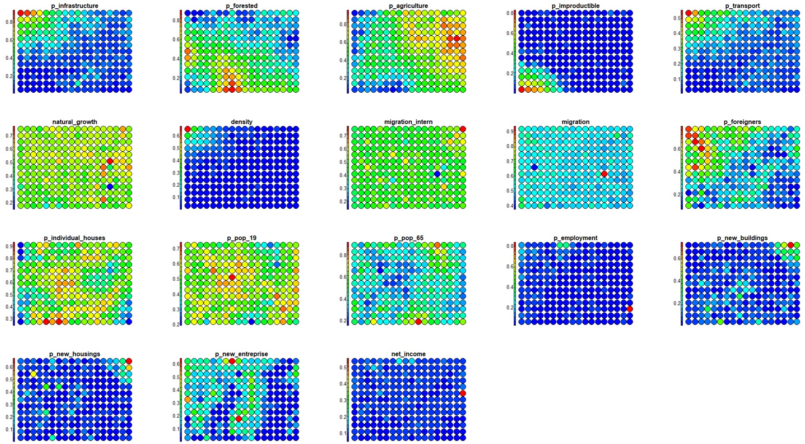
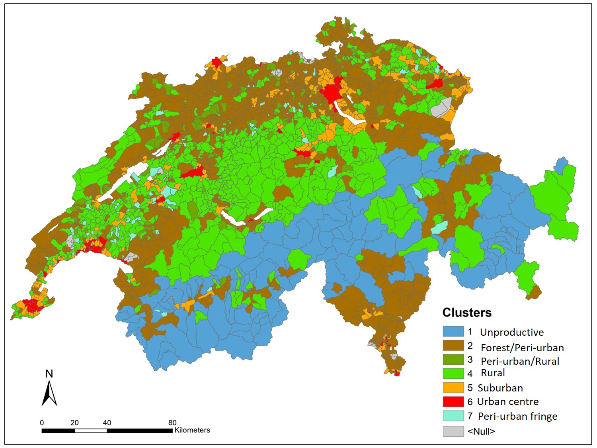

# Self-organizing Map

```{r  global-options, echo=FALSE, warning=FALSE}
knitr::opts_chunk$set(message = FALSE, warning = FALSE)
```

## Introduction

The increasing availability of multivariate datatets stimulates researches to develop new techniques that differ from those utilized in earlier scientific paradigms.
In the field of social and economic science, geo-demographic segmentation defines a technique used to classify a population based on input data describing administrative units and people living there [see @spielman_social_2008].
Small areas can thus be classified into discrete categories using demographic input data, by means of data reduction techniques (such as the *Principal component analysis*).
The main limitation of these approaches is the problem of communicating the multidimensional complexity characterizing the different output classes.

**Machine learning** techniques can help in this context, as they are designed to extract useful formation and insight from the interaction of the variables describing the complex structure of a given phenomenon.
In the present computing lab we introduce an unsupervised learning procedure based on *Self-Organizing Map (SOM)* [see @kohonen_self-organized_1982], allowing detecting clusters and characterizing the pattern of population dynamic in Switzerland in the recent period.
This lab is inspired by the work of @marj_tonini_unsupervised_2023.

## Material and method

### The geo-demographic context

Switzerland has the highest life expectancy in the world.
It counts about 8,5 million inhabitants (official census data 2020), twice as much as at the beginning of the 20th century, mainly because of the high level of immigration.
The number of foreigners that currently reside in the country corresponds to about one quarter of the total population.
Most of the population (85%) lives in cities.
Population aging increased over the course of the 20th century, with one in five person of retirement age today.
In the present study, we developed a machine learning based approach to understand and describe the population patterns in different geographic areas.

### SOM

We use **SOM**, an *unsupervised competitive learning neural network* allowing representing a high-dimensional feature space (defined by the multivariate input dataset), as two-dimensional discretized pattern (the SOM grid of neurons).
In SOM the proximity of the units in the output grid reflects the similarity of the corresponding input observations, which guarantees the preservation of the topological structure of the input data.

Compared to other approaches, SOM is very efficient for data visualization.
Indeed it provides additional outputs such as the heatmaps, representing the distribution of each input feature across the SOM grid, extremely useful to visually explore the relationship between the input variables.

### Swiss census data

Input data come from the national population census, provided by the [Swiss Federal Statistical Office](https://www.bfs.admin.ch/bfs/en/home.html), and including information on the socio-economic status of the population and surveyed land use and land cover.
This information has been aggregated to the municipality level for the purpose of the present investigation.
Census data 2020 have been considered to analyse the current pattern, while the former census surveys can be considered to assess transitions and evaluate population dynamics.

## Variables inspection

### Import the data

Fist, you have to import the Swiss census dataset for the year 2020, referred to the municipality administrative units.
As you can see from the description of the selected variables \autoref{Variables}, some of them can be discarded from the analysis.
So, in the following step, we extract a subset of the most meaningful variables for the purpose of the present study.

```{r variables, fig.cap="Variables description \\label{Variables}", dpi=600, out.width="100%", out.height="100%"}
               
knitr::include_graphics(c("images/Variables1.jpg", "images/Variables2.jpg"))
```

```{r import-data, include=FALSE}
# Import the entire the dataset
data2020 <- read.csv("data/Lab04/census2020.csv")
summary(data2020)
str(data2020)

# Import the subset with few variable selected
subset2020 <- read.csv("data/Lab04/subset2020.csv")
str(subset2020) # the field X represents the unique identifier 
```

### Inspect the data

Plotting the histogram of the variables distribution allows to detect outliers, see if they have comparable range of values, and evaluate if a data transformation is necessary.

```{r plot-hist, fig.show='hide'}
# Plot variables' frequency distribution
for(i in 3:ncol(subset2020)) {      
    hist((subset2020[ , i]),  main=colnames(subset2020[i]))
}
```

### Data transformation

Data transformation seeks the make the variables range comparable.
This process ensure the data entries to look similar across all fields and records, making information easier to find, group and analyze.

With **Min-Max Scaling**, the data values are scaled in a range between 0 and 1.
As a consequence, the effect of outliers suppresses to a certain extent.
Moreover, it helps us to have a smaller value of the standard deviation of the data scaled.

```{r max-min, results='hide'}
# Custom function to implement min max scaling
minMax <- function(x) {
  (x - min(x)) / (max(x) - min(x))
}

# Apply max-min to the data
dfnorm2020<- as.data.frame(lapply((subset2020[ , -c(1,2)]), minMax))
summary(dfnorm2020)
```

```{r plot-hist-maxmin, fig.show='hide'}
# Plot the histograms of the transformed data 
for(i in 1:ncol(dfnorm2020)) {      
    hist((dfnorm2020[ , i]),  main=colnames(dfnorm2020[i]))
}
```

## Running SOM

### Load the libraries

Fist you have to load the following libraries:

-   **kohonen**: Supervised and Unsupervised Self-Organizing Maps (SOM)

-   **aweSOM:** offers a set of tools to explore and analyze datasets with SOM

-   **ggplot2**: create Elegant Data Visualizations Using the Grammar of Graphics

-   **colorpatch**: rendering methods (ggplot extensions)

```{r load_lib, results='hide'}
library(kohonen)
library(aweSOM)
library(ggplot2)
library(colorpatch)
(.packages())
```

### Compute SOM

The main idea with **SOM** is to map the input high-dimensional feature space in a lower-dimensional output space organized on a grid made up of regular units (i.e. the neurons).
At the end of the process, each observation from the input space ($X_{k,i}$) will be associated (i.e., mapped) to a unit in the SOM grid.
Depending on the size of the grid, one unit can include several input observations.

The first step consists in defining the size and geometry of the SOM grid.
In this case we define a rectangular grid of 18 by 13 units, allowing to allocate, on average, about 15 input-items per units, and whose geometry reproduces the shape of the study area.
(**NB**: several parameters and configurations of the SOM grid can be implemented and compared, seeking to minimize the *Quantization Error, QE*)

Finally, you can run the SOM model.
Note that *rlen* indicates the number of times the complete data set will be presented to the network, while for the other parameters we will keep the default values.

The overall computation include the following steps:

**1) The data frame has to be transformed to a matrix**

```{r df-to-matrix, results='hide'}
mxM2020<-as.matrix(dfnorm2020) # max-min
```

**2) Create the SOM-grid**

Before running SOM, you have to create the grid of output units.

```{r SOM-grid}
# Gird size 18x13 units
som_grid <- somgrid(xdim = 18, ydim=13) 
```

**3) Run-SOM**

The general R function \textcolor{red}{set.seed()} is used for creating simulations of random objects that can be reproduced.

```{r run_SOM_maxmin}
# Use max-min data transformation
set.seed(123) 

# Run SOM
SOM2020M<- som(mxM2020,
               grid=som_grid, 
               rlen=1000)
print(SOM2020M)
```

**4) SOM-model evaluation**

Finally, you can optimize the size of the grid by inspecting several quality measure and changing the parameters accordingly.
In particular we will explore the following:

-   *Changes*: shows the mean distance to the closest codebook vector during the training.

-   *Quantization error*: average squared distance between the data points and the map's codebook to which they are mapped.
    Lower is better.

-   *Percentage of explained variance*: similar to other clustering methods, the share of total variance that is explained by the clustering (equal to 1 minus the ratio of quantization error to total variance).
    Higher is better.

```{r SOM-quality}
# Evaluate rlen
plot(SOM2020M, type="changes")

# Evaluate the results
QEM<-somQuality(SOM2020M, dfnorm2020) 

## Quality measures:
QEM$err.quant # Quantization error
QEM$err.varratio # % explained variance
```

## SOM's main outputs

The main graphical outputs of SOM are the node counts, the neighborhood distances, and the heatmaps.

-   **Node counts map** informs about the number of input vectors falling inside each output unit.

-   **Neighbourhood distance plot** shows the distance between each unit and its neighborhoods.

-   **Heatmaps** show the distribution of each input variable, associated to each input vectors, across the SOM grid.

```{r outputs-SOM-maxmin}
# Create a color palette
coolBlueHotRed <- function(n, alpha = 1) {rainbow(n, end=4/6, alpha=alpha)[n:1]}

par(mfrow = c(1, 2))

# Plot node counts map
plot(SOM2020M, type="count", main="Node Counts", palette.name=coolBlueHotRed)

# Plot SOM neighbourhood distance
plot(SOM2020M, type="dist.neighbours", main = "SOM neighbour distances")

```

Visualized side by side, heatmaps provide a useful tool to explore the correlation between the input variables \autoref{Heatmaps}.

```{r Heatmaps-SOM-M, fig.show='hide'}
# Plot heatmaps for selected variables
for (i in 1:18) 
  {
plot(SOM2020M, type = "property", property = getCodes(SOM2020M)[,i],
     main=colnames(getCodes(SOM2020M))[i], palette.name=coolBlueHotRed)
  }
```

```{r jpg1, fig.cap="Heatmaps \\label{Heatmaps}", dpi=300, out.width="70%", out.height="70%", fig.align="center"}

```

## Hierarchical clustering

Hierarchical clustering can finally be performed to isolate groups of input vectors characterized by a similar distribution of the input variables.
This second step takes the SOM-units (i.e., the CodeBook vectors) as input and group them into the desired number of clusters (we choose 7 in this case).
This allows to characterize main typologies of geo-demographic groups.

-   **Apply hierarchical clustering:**

```{r hclust_maxmin}
CB2020M <- getCodes(SOM2020M) # Extract codebook vectors

cls2020M <- cutree(hclust(dist(CB2020M)), 7)
```

-   **Display the SOM-grid with different colors for each cluster:**

```{r clustermap_maxmin}

# Colour palette definition, will use later too.
# If you change the number of hierarchical clustering, remember change the number of color.

map_palette <- c("steelblue3","darkgoldenrod4","darkolivegreen", "springgreen3", "darkorange", "firebrick", "darkolivegreen1" )

plot(SOM2020M, type="mapping", pchs="", bgcol = map_palette[cls2020M], main = "Clusters")
```

-   **Assign the cluster number (based on hierarchical clustering) to each unit:**

```{r export-clusters-M}
clasgn <- cls2020M[SOM2020M$unit.classif]
dfnorm2020$hc<-clasgn
clsnorm<-cbind(dfnorm2020, subset2020$BFS_nummer)

# Export the table with clusters 
write.table(clsnorm, file="hcM_7cls.csv", sep=",")
```

-   **Map the resulting clusters to the geographical space**

You can import the final table with the values of the population census variable in a GIS and join the values to the administrative limits at municipality levels in Switzerland.
This allows you to elaborate a map as in \autoref{Clusters_7}.

**NB**. You need only two columns: the code identifying each municipality ("BFS_nummer") and the cluster number (hc).
Open the table including the resulting clusters with a dedicated program (like Excel) to reorganize the header, as a new column for unique identifier has been created automatically (you can name it "ID"), and headers has to be shifted of one place on the right.

```{r jpg2, fig.cap="Spatial pattern distribution of Swiss poputaion census \\label{Clusters_7}", dpi=300, out.width="70%", out.height="70%", fig.align="center", echo = FALSE}

```

If you want to try the primary and automatic process in Rstudio, you can conduct the below codes and see the map.

```{r load package for visualtion}
library(st)
library(sf)
library(ggplot2)
library(ggspatial)
library(dplyr)
```

```{r load and preprocess dataset, results='hide', fig.show='hide'}
# Load the shapefile data
CH_outline <- st_read("data/Lab04/Municiplities.shp")

# Quick check the shapefile data
ggplot() + 
  geom_sf(data = CH_outline, size = 1.5, color = "black", fill = "cyan1") + 
  ggtitle("Swiss municiplities") + 
  coord_sf()

# Rename the column
colnames(clsnorm)[20] <- "BFS_NUMMER"

# Merge the dataframe and shapefile together by the column with the same name
z = merge(CH_outline, clsnorm, by = "BFS_NUMMER")

# Rename the column with clustering results
z$cluster <- as.numeric(z$hc)
```

```{r mapping the clusters, results='hide'}
# Mapping the clusters via ggplot like QGIS/ArcGIS Pro/Arcmap, similar package 'tmap'
CH_cluster <- ggplot(data = z) + # Original data
    geom_sf(aes(fill = as.factor(cluster))) + # Mapping the clusters
    annotation_scale(location = "bl", width_hint = 0.3,
                     pad_x = unit(0.2, "cm"), pad_y = unit(0.1, "cm")) + # Mapping scales, which are calculated by project coordinates
    annotation_north_arrow(location = "tr", which_north = "true", 
          pad_x = unit(0.0, "cm"), pad_y = unit(0.1, "cm"),
          style = north_arrow_fancy_orienteering) + # Mapping north arrow
    scale_colour_manual(values = map_palette) + # Set up the our color palette
    theme_minimal() + # Background color, if use, it means without color
    labs(title = "Spatial pattern distribution of Swiss poputaion census") + # Insert title of the map
    scale_fill_discrete(name = "Clusters", 
                        labels = c("1: Unproductive", "2: Forest/Peri-urban", "3: Peri-urban/Rural",
                                 "4: Rural","5: Suburban","6: Urban centre","7: Peri-urban fringe")) # Legend labels
    guides(fill=guide_legend(title="Clusters")) # Legend name

# Save the map as jpg
ggsave("CH_cluster.jpg")
    
CH_cluster
```

### Clusters characterization

To interpret the final main clusters in therms of their geo-demographic characteristics, you can evaluate the distribution of each variable within the clusters by using **box plots** (also known as *whisker plot*).

Box-plot is a standardized way to display a dataset based on the five-number summary statistics: the minimum, the maximum, the sample median, and the first and third quartiles (i.e., the median of the lower half (25%) and the median of the upper half (75%) of the dataset).

```{r boxplot-clsM, fig.show='hide'}

# Creates an empty list object that will be filled by the loop
cls20M <- list() 

# Split the single clusters
for(i in 1:7) {
  cls20M[[i]]<-subset(clsnorm, clsnorm$hc==i) 
}

clsvar20M <- lapply(cls20M, "[", c(1:18)) 

# Box-plots for the single clusters
for (i in 1:7) {boxplot ((clsvar20M[[i]]), main=paste("Cluster", i), mar=c(8,3,3,1), cex.axis=0.5,  las=2)}
```

To better investigate the values assumed by each class of variables withing the different clusters, you can group them by category.

```{r boxplot-clsM-PhisicalSpace, fig.cap="Physical space"}

# Box plot by categories: "Physical space"

clsvar20M <- lapply(cls20M, "[", c(1:5)) 

par(mfrow=c(2,4), mar=c(7,3,3,1), cex.axis=0.7)

for (i in 1:7) {boxplot ((clsvar20M[[i]]), main=paste("Cluster", i),  las=2)}
```

```{r boxplot-clsM-Deographic, fig.cap="Demographics"}

# Box plot by categories: "Demographics"

clsvar20M <- lapply(cls20M, "[", c(6:13)) 

par(mfrow=c(2,4), mar=c(7,3,3,1), cex.axis=0.7)

for (i in 1:7) {boxplot ((clsvar20M[[i]]), main=paste("Cluster", i),  las=2)}
```

```{r boxplot-clsM-SocioEconomic, fig.cap="Socio-economics"}

# Box plot by categories: "Socio-economics"

clsvar20M <- lapply(cls20M, "[", c(14:18)) 

par(mfrow=c(2,4), mar=c(7,3,3,1), cex.axis=0.7)

for (i in 1:7) {boxplot ((clsvar20M[[i]]), main=paste("Cluster", i),  las=2)}
```

## Conclusions

Results of the present study reveal the main patterns of the population in Switzerland based on the surveyed land-use, socio-economic, and demographic indicators.
To characterize the final main clusters, the distribution of each variable within them have been assessed by using **box plots**.
We could thus identify main clusters including the most developed and active cities with higher income, the peri-urban areas mostly devoted to the agricultural activity, or the areas with higher levels of migration.

**SOM heatmaps** allow to display the pattern distribution of each input variable over the SOM-grid and how values change in space.
Visualized side by side, heatmaps show a picture of the different areas and their characteristics.
In this way it is possible to explore the level of complementarity that links one or more variables among them.

In conclusion, in the present study we proposed a performant data-driven approach based on unsupervised learning allowing to extract useful information from a huge volume of multivariate population census data.
This approach led to represent and interpret the main patterns characterizing the dynamic of population in Switzerland in the recent period.

## Further analyses

To be sure that everything is perfectly clear for you, we propose you to **answer the following questions** and to discuss your answers with the other participants to the course or directly with the teacher.

1)  Change the size of the gridmap and check if you get better results for SOM. **N.B.** Better results are achieved when the quantisation error decreases, the explained variance increases, and there are no empty observations revealed by the Node Counts map.

2.1) Focusing on Cluster 6: which variable characterize it the most?
Based on these variables, which class of land use can be associated to this cluster?
2.2) And in the case of Cluster 4?

3)  Describe the distribution of the clusters in the geographical space.
    In more details, describe to which kind of land use the different clusters can be referred and specify why.

4)  From the visual inspection of the heatmaps, describe the correlation you can observe between the following variables: a) "p_transport" and "p_infrastructure"; b) "p_agriculture" and "p_improductible".
