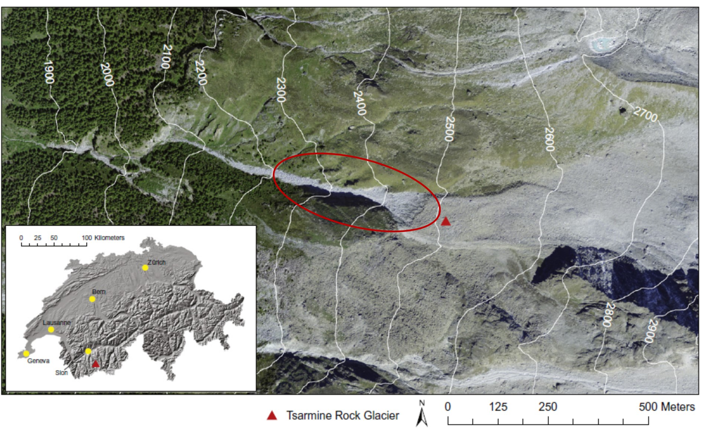
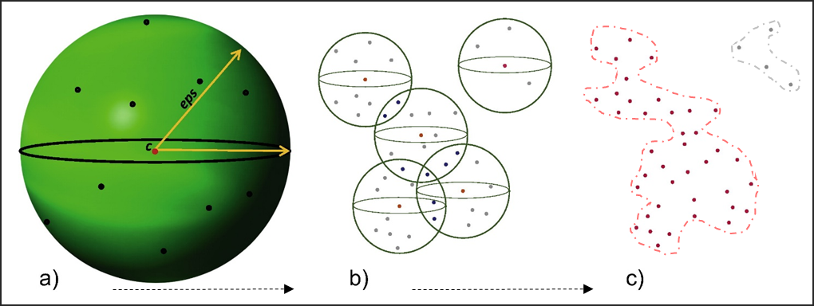

# Density-based Clustering Algorithm

```{r  global-options, echo=FALSE, warning=FALSE}
knitr::opts_chunk$set(message = FALSE, warning = FALSE)
```

## Introduction

Terrestrial laser scanning (TLS) has been one of the most successful methods for 3D data collection in the last few years.
Sequential acquisition can be used to detect and quantify surface changes.
The three main challenges arising from TLS data collection are: 1) the large number of points acquired is computationally intense and datasets have to be filtered depending on the aim of the investigation; 2) data collection methods suffer from perspective effects, which can lead to either zones of occlusion (shadow effect) or spatially-variable point densities; 3) 3D point clouds are normally interpolated to digital elevation models either as regular grids or triangulated irregular networks.
Thus, for change detection proposes (i.e. determination of topographic change, including erosion and deposition), it is appropriate to develop methods based upon the direct analysis of the point clouds using semi-automatic approaches allowing to detect and extract individual features.

In this practical computer lab we introduce a semi-automated method developed for isolating and identifying features of topographic change (i.e., apparent changes caused by surface displacements and indicating erosion or deposition) directly from point cloud data using a Density-Based Spatial Clustering of Applications with Noise (DBSCAN).
This methodology was developed by @micheletti_geomorphological_2017 for a very active rock glacier front located in the Swiss Alps: the Tsarmine rock glacier.

```{r jpg, fig.cap="The Tsarmine rock glacier, Hérens Valley, in the Western Swiss Alps. Source: Micheletti et al, 2016 \\label{Tsarmine}", dpi=300, out.width="50%", out.height="70%", fig.align="center", echo = FALSE}

```

## The overall methodology

**Stepwise analysis:**

1.  Point clouds were generated using a TLS on a number of dates.
2.  Point clouds were co-registered using stable zones within the surveyed area.
3.  Using a threshold value, only the points where there may have been some topographical change were selected.
4.  The final dataset was treated with DBSCAN, aiming at grouping cluster-points into single features and filtering out noise points, found in low-density regions.

The present lab deals with steps 2 and 3: feature detection using DBSCAN.
The detected features are finally labeled as clusters and visualized in a 3D map.

Material loss or gain can be analysed in a GIS environment according to the elevation assignment of the change and the volume of change computed for each cluster by a triangulation process (not performed in this lab).

### DBSCAN: 3-D density based clustering algorithm

DBSCAN allows identification of spatial clusters of arbitrary shape on the base of the local density of points.
Points that are close together are grouped into the same cluster, while isolated points are labelled as noise.

Two parameters are required to perform this classification: the minimum number of points necessary to form a cluster ($MinPts$), and the neighborhood size epsilon ($eps$).
The algorithm explores each point in the dataset, counting the number of the neighboring points falling within a circle (for the 2D model) or a sphere (for the 3D model) of radius equal to $eps$ (\autoref{dbscan}a).
If this number is equal to or greater than $MinPts$, points are labelled as belonging to the same cluster (\autoref{dbscan}b).
If this number is lower than $MinPts$, points are classified as noise.
The central point of each cluster is called core-point.
Since some points can be density-reachable by more than one core-point, they can belong to more than one cluster.
In this case clusters are blended together to form a unique cluster feature of arbitrary shape (\autoref{dbscan}c).

```{r fig2, fig.cap="Parameters in DBSCAN to form a cluster \\label{dbscan}", dpi=300, fig.align="center", echo=FALSE}

```

### Field campaign

An ultra-long range LiDAR RIEGL VZ-6000 scanner was employed to acquire sequential 3D datasets of the rock glacier front.
TLS scans were performed on different dates over two consecutive summers: a first survey was carried out on the 23th of September 2014, and the last one on the 22th of September 2015.

The instrument is equipped with on-board inclination sensors: this allows to use the inclination data to obtain (locally) georeferenced datasets where the Z dimension represents the elevation above the X-Y plane.
After co-registration, a mask was used to restrict point clouds to the area of interest: the front of the rock glacier and the corridor below.

DBSCAN requires as input a 3-dimensional dataset, which in our case consists on the points clouds (X,Y,Z) plus the displacement distance.
For the two co-registered datasets (2014 and 2015), we set the first as the target and the more recent as the reference.
For each point in the target cloud the corresponding nearest point in the reference cloud was identified and the distance between them evaluated using the software Cloud Compare.
Co-registration errors, estimated as noise and not real material loss/gain signals, has to be removed from the analysis.
Here, we noted from field observations that the size of displaced boulders is typically \> 0.30 m and we use this as a change criteria to remove the noise.

## DBSCAN: feature detection from points clouds

### Load the libraries

Fist you have to load the following libraries: - **dbscan**: A fast implementation of several density-based algorithms of the DBSCAN family.
- **rgl**: Provides medium to high level functions for 3D interactive graphics - **plot3Drgl**: Plot 3D graphs in rgl window.
- **classInt**: Selected methods to choose class intervals for mapping puposes.\
- **RColorBrewer**: Provides color schemes for mapping.

```{r libs-loaded, message = FALSE, warning = FALSE}

library("dbscan")
library("rgl")
library("plot3Drgl")
library("classInt")
library("RColorBrewer")

(.packages())
```

### Import and visualise the point clouds dataset

We provide the dataset corresponding to one-year displacement distance, masked over the the rock glacier front.
The noise-points are removed using a threshold of 30 cm.
Finally we will plot the 3D-points cloud filtered dataset using the displacement distance as attribute to display the map.

```{r import-data, results = FALSE}
# Import point cloud dataset (ptc)
# 1 year displacement TLS campaigns; data masked over the active front only.
ptc <- read.table("data/Lab03/TsarmineRG_230914_frontonly_XYZ_dist_ref_220915.txt", header=FALSE, sep="")

# Add names to columns: X,Y, Z coordinates and the displacement distance "d".
colnames(ptc)<-c("Y","X","Z","d") # rename columns

# Inspect the dataset:
str(ptc)
summary(ptc$d)
hist(log10(ptc$d))
```

```{r subset, results=FALSE}
# Create a subset: removing noise-points (d>30cm).
ptc30 <- subset(ptc, d>=0.3)

# Inspect the subset:
str(ptc30)
summary(ptc30$d)
```

```{r points-clouds}

# Plot-3D: display 3D plot (X,Y,Z) with class intervals based on the distance d.

# Create a class interval (int) based on natural breaks:
int <- classIntervals(ptc30$d, n=5, style="fisher") 
  cut.vals<-int$brks
  d.cut <- cut(ptc30$d,cut.vals)
  cut.levels <- levels(d.cut)
  cut.band <- match(d.cut,cut.levels)
  cls <- rev(brewer.pal(length(cut.levels), "RdYlGn"))
  
# Display the 3D-plot:
scatter3D(ptc30$X, ptc30$Y, ptc30$Z, colvar =ptc30$d, breaks=cut.vals, cex=0.5)
plotrgl() #animated 3D-plot
```

### Run DBSCAN

The two parameters $eps$ and $MinPts$ greatly affect the output cluster detection leading the the identification of a large number of small clusters (for small values) or a small number of large features of arbitrary shape (for large values).
Once fixed the $MinPts$ parameter, a suitable value for the $eps$ neighborhood size can be estimated using a **k-nearest neighbors (k-NN) distance graph**, imposing k as equal to $MinPts$ and plotting the distance to the nearest neighbors.
The optimal $eps$-value should coincide with the stronger curvature of the curve.

In the following, the minimum number of points allowing to form a cluster is fixed first, and then the plot of the k-nearest neighbor (k-NN) distance is used to find a suitable value for the $eps$ neighborhood size.
We can use this function to find the NN-distance (for a given k-value) corresponding to the stronger curvature.
This values gives the best neighborhood size $eps$

```{r k-NN-graph}

# Plot the k-NN distance graph (with k=10)
kNNdistplot(ptc30[,-4], k = 10)
```

Once the best $MinPts$ adnd $eps$ parameter have been selected, the DBSCAN function can be run.

```{r dbscan, results = FALSE}

# Eps=1m (~3xsigma) ; MinPts=10
cl30<-dbscan(ptc30, 1, minPts=10)

# Inspect the results:
str(cl30)
summary(cl30$cluster)
sum(cl30$cluster==0)

# Plot only the detected clusters.

# Join the data:
cl30<-cbind(ptc30, cluster=cl30$cluster)
# Save as data frame and remove the noise (label==0)
cl30_df<-as.data.frame(subset(cl30, cl30$cluster>=1))
# Simple plot:
plot(cl30_df$X, cl30_df$Y, col=cl30_df$cluster, pch=20)
# Animated 3D-plot:
plot3d(cl30_df, col=cl30_df$cluster, pch=20)
```

Finally you can export the result as a .txt file and import in a GIS system for further analyses, such as to determine the volumes of loss or gain of material.

```{r export-cl}
write.table(cl30_df, file="cls30_1_10.txt", sep="\t")
```

## Conclusions and further analyses

The proposed method permitted detection of features of changes on a rock glacier front located in the Swiss Alps.
Single cluster features of erosion and deposition/front movements were extracted directly from point clouds, detected by DBSCAN without the necessity of interpolate the 3-D original data.

To be sure that everything is perfectly clear for you, we propose you to do this lab again, by changing the values of *MinPts* and *eps* and discuss the compare the resulting extracted features.
