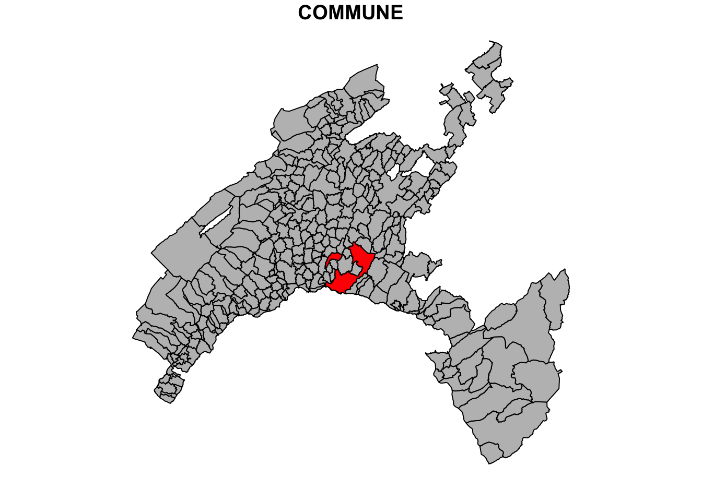
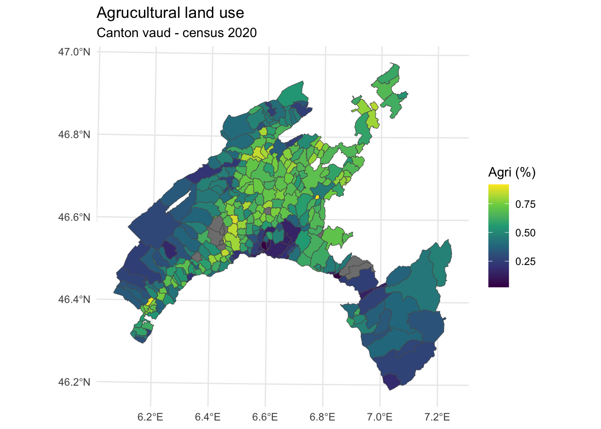
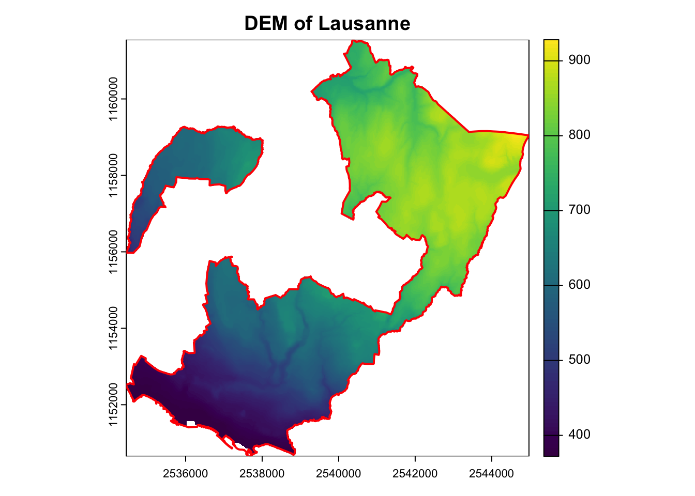

# Basic operation with geodata in R

## Introduction

Geodata, or geospatial data, refers to features associated with a specific location on the Earth's surface.
Geodata can be in various forms and is often used in Geographic Information Systems (GIS) for mapping and analysis.
The two key components characterizing geodata are **spatial identifier** and **attributes**.
Spatial identifier specifies the location and shape of the features, with different levels of detail, while attributes describe their characteristics.

The **two basic formats** used to represent the spatial component of geodata are:

1.  **Vector**: this format uses points, lines, and polygons to identify each individual features.
2.  **Raster**: this format uses a regular grid of pixels to represent the global geographic context.

In addition, **attribute tables** are used to store the characteristics associated with the geospatial features.

The GIS software are specifically designed to help user to edit, manage, analyze, and map geodata.
To make working with geodata easier, several packages have been developed in R.
These packages allow users to handle geodata directly in R computing environment, without needing separate GIS software.

In this chapter, we introduce the basic functions allowing to work with geodata in the pre-processing and post-processing phase of a pipeline in geomodeling.

## Plotting vector dataset

The spatial component of geodata uses geometric primitives like point, line, and polygon to represent the single features.
Each feature in a geodataset is associated with various attributes providing detailed quantitative and qualitative information.
A single geodataset includes features of the same type, represented by using the same class of primitive.

The three basic geometric vector primitives have the following characteristics:

-   **Points**: defined by a single pair of coordinates (x, y) representing a specific location. Used to represent small objects like weather stations, city center, or to identify single features in a geohazard inventory (e.g., earthquake's epicenter, landslides location, wildfires, etc.).
-   **Lines**: defined by pairs of coordinates connected to each other, representing linear features such as roads or rivers network, pathways, railway, etc.
-   **Polygons**: defined by a series of connected coordinates that enclose an area, representing features such as lakes, administrative units, vegetation patches, burned area, landslides footprint.

### Package **sf** and vector dataset

The package **sf** (Pebesma 2022) has been designed to work with vector data as "simple features" in R.
Each feature is represented by one row in the data frame, with attributes stored as columns and spatial information stored in a special geometry column.


As a toy example, we will work with the geodataset of administrative boundaries in the Canton of Vaud (Switzerland).
This dataset is available in shapefile format, one of the most widely used file formats for vector geospatial data.

A **shapefile** includes multiple files allowing to store different kind of object:

-   \*shp: the features' geometries (i.e., the geometric vector primitive used to describe the features).
-   \*dbf: the attributes, describing the characteristics of the features (i.e., tabular information).
-   \*shx: shape index format, an index file for the geometry data.
-   \*prj: the coordinate reference systems, defining how the geometries are projected on the Earth's surface.

To read a shapefile, you only need to specify the file name with ".shp" extension.
However, it is important to have all related files in the same directory.
Having all these files ensures that the shapefile is read correctly and all necessary information is available for the analysis.

Shapefiles can be imported and converted as sf-objects using the command `st_read()`.
By setting the argument `quiet = FALSE` suppresses the output from the console when importing geodata.


``` r
# Load dataset
vaud <- st_read("data/RGIS/Canton_de_Vaud.shp", quiet = FALSE)
```

```
## Reading layer `Canton_de_Vaud' from data source 
##   `/Users/hliu5/Documents/AGDAbook/data/RGIS/Canton_de_Vaud.shp' 
##   using driver `ESRI Shapefile'
## Simple feature collection with 315 features and 4 fields
## Geometry type: POLYGON
## Dimension:     XY
## Bounding box:  xmin: 2494306 ymin: 1115149 xmax: 2585462 ymax: 1203493
## Projected CRS: CH1903+ / LV95
```

### Plot vector features

Basic maps can be created in sf with the command `plot()`.
By default this creates a multi-panel plot: one plot for each variable included in the geodata (corresponding to each column).
Othewise, this command have to be followed by the name variable that you wish to display.


``` r
# Inspect the attribute table 
str(vaud)
```

```
## Classes 'sf' and 'data.frame':	315 obs. of  5 variables:
##  $ COMMUNE   : chr  "Payerne" "Rossinière" "Vallorbe" "Puidoux" ...
##  $ NUMERO_COM: num  5822 5842 5764 5607 5745 ...
##  $ Shape_Leng: num  30547 21405 27147 31111 28268 ...
##  $ Shape_Area: num  24178457 23354685 23190781 22858943 22501915 ...
##  $ geometry  :sfc_POLYGON of length 315; first list element: List of 1
##   ..$ : num [1:783, 1:2] 2559434 2559258 2559286 2559263 2559337 ...
##   ..- attr(*, "class")= chr [1:3] "XY" "POLYGON" "sfg"
##  - attr(*, "sf_column")= chr "geometry"
##  - attr(*, "agr")= Factor w/ 3 levels "constant","aggregate",..: NA NA NA NA
##   ..- attr(*, "names")= chr [1:4] "COMMUNE" "NUMERO_COM" "Shape_Leng" "Shape_Area"
```

``` r
# Basic plot (diplay all the variables)
plot(vaud) 
```


``` r
# Display each municipality using single color (attributed randomly)
plot(vaud["COMMUNE"])
```


A legend with a continuous color scale is produced by default if the object to be plotted is numeric.


``` r
# Plot based on the value "area" 
plot(vaud["Shape_Area"], reset = FALSE)
```


Different operations can be performed to customize the map.
For instance, we can higlight the municipality of Lausanne in red to show its geographic correspondence, keeping all the other municipalities grey.


``` r
# Extract the Lausanne boundary
Vaud_Lausanne = vaud[vaud$COMMUNE == "Lausanne", ]

# Union and merge the geometry
Lausanne = st_union(Vaud_Lausanne)

# plot the Lausanne municipality over a map of Canton of Vaud
plot(vaud["COMMUNE"],col="grey", reset = FALSE)
plot(Lausanne, add = TRUE, col = "red")
```



## Plotting raster dataset

Raster data are different from vector data in that they are referenced to a regular grid of regular (usually square) cells, called pixels.
The spatial characteristics of a raster dataset are defined by its spatial resolution (the height and width of each cell) and its origin (typically the upper left corner of the raster grid, which is associated with a location in a coordinate reference system).

Raster data is highly effective for modeling and visualizing continuous spatial phenomena such as elevation, temperature, and precipitation.
Each cell in the grid captures a value representing the attribute at that specific location, allowing for smooth and detailed gradients across the study area.
This format is also effective in representing categorical variables such as land cover, where each cell is associated with a class value.

Common raster formats used for spatial analses include:

1.  **GeoTIFF (.tif, .tiff)**:
    -   A widely used format that includes geographic metadata such as coordinates and projection information, making it easy to integrate with GIS applications.
2.  **ESRI Grid**:
    -   A proprietary format developed by ESRI for use with its software, such as ArcGIS. It supports both integer and floating-point grids.
3.  **Erdas Imagine (.img)**:
    -   A format developed by ERDAS for its Imagine software, often used for remote sensing data and satellite imagery. It supports large files and multiple bands.
4.  **NetCDF (.nc)**:
    -   Stands for Network Common Data Form, used for array-oriented scientific data, including GIS data. It supports multidimensional data arrays, making it suitable for complex environmental and atmospheric data.
5.  **HDF (Hierarchical Data Format)**:
    -   Similar to NetCDF, HDF is used for managing and storing large amounts of data, especially in scientific computing. It supports various data types and is used for satellite imagery and climate data.
6.  **ASCII Grid (.asc)**:
    -   A simple, text-based raster format where each cell value is represented by a number in a grid layout. It's easy to read and edit with a text editor.

These formats vary in terms of compression, metadata support, and suitability for different types of raster data, from simple images to complex scientific datasets.

### Terra package and raster dataset

The package **terra** provides a variety of specialized classes and functions for importing, processing, analyzing, and visualizing raster datasets (Hijmans 2022).
It is intended to replace the **raster** package, which has similar data objects and the function syntax as **terra** package.
However, the **terra** package contains several major improvements, including faster processing speed for large raster.


``` r
# Load the libraries 
library(terra)
library(dplyr)
library(ggplot2)
```


``` r
# Load the libraries 
library(terra)

# Load the raster data
Vaud_dem <- rast("data/RGIS/DEM.tif")

# Inspect the raster
Vaud_dem
```

```
## class       : SpatRaster 
## dimensions  : 3524, 3647, 1  (nrow, ncol, nlyr)
## resolution  : 25, 25  (x, y)
## extent      : 494300, 585475, 115150, 203250  (xmin, xmax, ymin, ymax)
## coord. ref. : CH1903 / LV03 (EPSG:21781) 
## source      : DEM.tif 
## name        :    DEM 
## min value   :  372.0 
## max value   : 3200.1
```

### Plot raster features

Raster objects can be imported using the function ***rast()*** and exported using **writeRaster()**, specifing the format argument.

As a toy example, we will work with the raster \*.tif representing the digital elevation model (DEM) of Canton Vaud.

Similar to the **sf** package for ploting vector data, **terra** also provides plot() methods for its own classes.


``` r
# Plot raster dataset
plot(Vaud_dem, main="DEM")
```


## Geodata manipulation

In this section, we explore some basic manipulations with vector and raster geodata.
This will be useful in the following chapters of this book.

### Manipulate tabular datasets

In a vector dataset, the characteristics associated with geospatial features are stored in attribute tables.
Each feature in the vector dataset is linked to a row in the table, with its characteristics organized into columns.
Columns, also known as fields, store the various attributes associated with the features.

Thematic attributes stored in separate tabular dataset (such as census data, environmental monitoring stations, public health, or traffic data) can be imported and added to the attribute table of a given vector datased if the two dataset are referred to the same spatial feature.

While tabular dataset can be delivered in different format (such as \*.dbf, \*.xlsx, \*.txt), the most widely used format is \***.csv** (comma-separated values).
As for other tabular format, \*.csv is structured into rows and columns, where each column is separated by a comma.
The first row often contains the column headers (field names), which describe the attribute in each column.
The main advantages on this format compared with other formats are:

-   Simplicity: easy to create, read, and edit.

-   Lightweight: files are typically small and easy to transfer.

-   Compatibility: supported by most data processing tools and software.

In most cases, data need to be reworked before they can be visualized and analyzed in R.
Common tasks include: selecting subsets of rows or columns from the attribute table; rename a field; calculate new variables from the raw data values; compute summary statistics; combine data from different sources.
We explore some operations in the following chunks.


``` r
# Load tabular dataset
Swisscensus_2020 <- read.csv("data/RGIS/census2020.csv")

# Inspect the element 
str(Swisscensus_2020)
```

```
## 'data.frame':	2145 obs. of  35 variables:
##  $ ID_0                 : int  1 2 3 4 5 6 7 8 9 10 ...
##  $ ID                   : int  1 2 3 4 5 6 7 8 9 10 ...
##  $ p_infrastructure     : num  0.131 0.302 0.178 0.133 0.199 ...
##  $ p_forested           : num  0.307 0.28 0.287 0.291 0.332 ...
##  $ p_agriculture        : num  0.502 0.401 0.526 0.554 0.464 ...
##  $ p_improductible      : num  0.05815 0.01133 0.01077 0.025 0.00766 ...
##  $ surface_polygone     : num  791 1059 743 1360 653 ...
##  $ natural_growth_1000  : num  -1.001 2.115 4.65 2.119 0.528 ...
##  $ density              : num  255 1160 755 279 581 ...
##  $ dependency_ratio     : num  60.1 63.4 68.6 67.4 62.9 ...
##  $ migration_intern     : num  11.014 -6.1 -0.537 9.534 -2.905 ...
##  $ migration            : num  3.5 5.61 1.07 1.32 5.02 ...
##  $ p_employment         : num  0.105 0.415 0.109 0.14 0.364 ...
##  $ primary_sector       : num  0.19388 0.06495 0 2.12 0.00187 ...
##  $ secondary_sector     : num  0.148 1.724 0 2.8 0.045 ...
##  $ tertiary_sector      : num  1.9898 7.6414 0.3155 16.1 0.0569 ...
##  $ p_social_assistance  : num  1.31 3.19 1.13 1.25 1.27 ...
##  $ p_new_buildings      : num  1.514 0.732 0.179 0.8 0.529 ...
##  $ p_new_housings       : num  5.048 4.552 0.179 1.333 1.059 ...
##  $ p_cinema             : num  0 0.0195 0 0 0 ...
##  $ p_museum             : num  0.000993 0 0 0 0.000264 ...
##  $ p_culture_institution: num  0.01142 0.00667 0.00588 0.00816 0.00606 ...
##  $ size_households      : num  2.28 2.19 2.37 2.39 2.38 ...
##  $ p_new_entreprise     : num  0.00497 0.00407 0.00267 0.00421 0.00369 ...
##  $ p_weddings           : num  2.5 4.8 4.65 2.65 1.85 ...
##  $ p_foreigners         : num  14.4 29 17.3 15.8 17.4 ...
##  $ p_individual_houses  : num  69.2 54.7 71.6 69.1 74.7 ...
##  $ Population           : num  2014 12289 5610 3801 3795 ...
##  $ p_pop_19             : num  19.8 22.3 21.9 22.1 19.3 ...
##  $ p_pop_65             : num  18.5 18.6 14.1 21.5 20.4 ...
##  $ lat                  : num  0.571 0.562 0.566 0.582 0.562 ...
##  $ long                 : num  0.735 0.738 0.756 0.719 0.748 ...
##  $ zab_2022             : num  69.6 285.9 92.4 126.6 102.8 ...
##  $ net_income_h         : num  57603 36521 45237 45791 48875 ...
##  $ p_transport          : num  5.06 7.69 5.11 4.55 4.89 ...
```


``` r
# Create a subset (including Land Use information)
Swisscensus2020_LU = subset(Swisscensus_2020, select = c(2:6))

str(Swisscensus2020_LU)
```

```
## 'data.frame':	2145 obs. of  5 variables:
##  $ ID              : int  1 2 3 4 5 6 7 8 9 10 ...
##  $ p_infrastructure: num  0.131 0.302 0.178 0.133 0.199 ...
##  $ p_forested      : num  0.307 0.28 0.287 0.291 0.332 ...
##  $ p_agriculture   : num  0.502 0.401 0.526 0.554 0.464 ...
##  $ p_improductible : num  0.05815 0.01133 0.01077 0.025 0.00766 ...
```


``` r
# Rename a column for better understanding
CH2020_LU <- rename(Swisscensus2020_LU, Urban=p_infrastructure)
head(CH2020_LU)
```

```
##   ID      Urban p_forested p_agriculture p_improductible
## 1  1 0.13147914  0.3072061     0.5018963     0.058154235
## 2  2 0.30217186  0.2804533     0.4013220     0.011331445
## 3  3 0.17765814  0.2866756     0.5262450     0.010767160
## 4  4 0.13308823  0.2911765     0.5536765     0.025000000
## 5  5 0.19908116  0.3323124     0.4640123     0.007656968
## 6  6 0.08712121  0.2058081     0.6830808     0.011363636
```

### Pipes: chaining of multiple operations

Pipes allow for the chaining of multiple operations in a unique sequence, which makes the code easier to understand and reduces the need for nested function calls.

The use of pipes in R, primarily facilitated by the **magrittr** package and now natively supported in base R (R version 4.1.0 and above), is a powerful way to write clear and readable code.
The function pipe is represented by the symbol `%>%`.
When a pipe is placed on the right side of an object or function, the output from the function is passed as the first argument to the next function after the pipe.

Below is a simple example of using the pipe operator with the function `select()`, used to select the the fields related to the land use in the Swiss census dataset corresponding to a population density less than 100.


``` r
LU_dens100 <- 
  Swisscensus_2020 %>%
  filter(density < 100) %>%
  select(2:6)
```

### Join table

A tabular dataset can be joined to the attribute table of a vector dataset by specifying the name of the columns in the two tables used for merging.
To this end, we can use the function `merge()` included in **sp** package.


``` r
Vaud_census_2020 <- merge(x=vaud, y=Swisscensus_2020,
                             by.x="NUMERO_COM", 
                             by.y="ID",
                             all.x=TRUE)

# Plot based on a joined attribute
plot(Vaud_census_2020["p_agriculture"])
```


### Mapping with ggplot2

Mapping in R can be efficiently achieved using the powerful visualization package **ggplot2**, especially when combined with additional packages like **sf**.
These tools enable users to create detailed and customized maps for spatial data analysis and visualization.
In particular **sf** facilitates the handling of complex spatial data structures, making it possible to create intricate and informative maps.

In the following example we crate an aesthetic map of Canton Vaud based on the percentage of agricultural land use by municipality.
Aesthetic mappings describe how the attributes of the geodata are mapped to the visual properties (aesthetics) of the plot.
The command aesthetics - `aes()` - control the appearance of the plot elements, such as points, lines, bars, and so on.


``` r
# Install viridis color scale as a package 
install.packages("viridis", repos="http://cran.us.r-project.org")
```

```
## 
## The downloaded binary packages are in
## 	/var/folders/hf/q_2qq0tn1dngf4r3nzfhj3xh0000gn/T//Rtmp98d3jw/downloaded_packages
```

``` r
library(viridis)

# Use ggplot2 for mapping
ggplot(Vaud_census_2020) +
  geom_sf(aes(fill = p_agriculture)) +
  scale_fill_viridis_c(option = "viridis", name = "Agri (%)") +
  theme_minimal() +
  labs(title = "Agrucultural land use",
       subtitle = "Canton vaud - census 2020")
```



### Cropping ratser

Many projects in environmental science require integrating data from various sources, such as remote sensing images (rasters) and administrative boundaries (vectors).
In these scenarios, raster cropping and masking are essential for standardizing the spatial extent of the input data.
These operations help to minimize memory usage and computational resources needed for subsequent analysis and are often a crucial pre-processing step before generating detailed and visually appealing maps that incorporate raster data.

First, verify if the coordinate reference systems (CRS) of the two input geodatasets are the same.
To do this, simply type the names of the geodatasets and check the "coord. ref." attribute.
For a detailed description of the coordinate reference system, use the `crs()` function.
If necessary, reproject one of the spatial layers using the `project()` function, specifying the CRS of the other dataset to ensure their extents perfectly overlap.


``` r
# verify CRS
Vaud_dem
```

```
## class       : SpatRaster 
## dimensions  : 3524, 3647, 1  (nrow, ncol, nlyr)
## resolution  : 25, 25  (x, y)
## extent      : 494300, 585475, 115150, 203250  (xmin, xmax, ymin, ymax)
## coord. ref. : CH1903 / LV03 (EPSG:21781) 
## source      : DEM.tif 
## name        :    DEM 
## min value   :  372.0 
## max value   : 3200.1
```

``` r
vaud
```

```
## Simple feature collection with 315 features and 4 fields
## Geometry type: POLYGON
## Dimension:     XY
## Bounding box:  xmin: 2494306 ymin: 1115149 xmax: 2585462 ymax: 1203493
## Projected CRS: CH1903+ / LV95
## First 10 features:
##           COMMUNE NUMERO_COM Shape_Leng Shape_Area
## 1         Payerne       5822   30546.68   24178457
## 2      Rossinière       5842   21404.88   23354685
## 3        Vallorbe       5764   27146.69   23190781
## 4         Puidoux       5607   31110.58   22858943
## 5         Baulmes       5745   28268.14   22501915
## 6      Corbeyrier       5404   26122.21   22002176
## 7  Vully-les-Lacs       5464   33182.64   20915807
## 8         Bassins       5703   29224.24   20772714
## 9   Mont-la-Ville       5491   20254.18   19791177
## 10       Avenches       5451   30004.81   19487486
##                          geometry
## 1  POLYGON ((2559434 1183900, ...
## 2  POLYGON ((2568027 1143632, ...
## 3  POLYGON ((2519472 1176171, ...
## 4  POLYGON ((2551941 1152936, ...
## 5  POLYGON ((2524665 1180813, ...
## 6  POLYGON ((2565278 1132847, ...
## 7  POLYGON ((2565363 1195281, ...
## 8  POLYGON ((2508540 1146203, ...
## 9  POLYGON ((2519784 1169416, ...
## 10 POLYGON ((2570746 1194939, ...
```

``` r
# Project the DEM data using the CRS of the shape 
demVD_prj = project(Vaud_dem, crs(vaud))

# Verify the difference
plot(Vaud_dem)
```


``` r
plot(demVD_prj)
```


``` r
# Extract the municipality of Lausanne
Lausanne <- filter(vaud, COMMUNE == "Lausanne")

# Crop the DEM to the extent of Lausanne (bounding box)
DEM_Lausanne_cropped <- crop(demVD_prj, Lausanne)

# Mask the cropped DEM using the Lausanne polygon to get the exact shape
DEM_Lausanne <- mask(DEM_Lausanne_cropped, Lausanne)

# Plot the DEM
plot(DEM_Lausanne, main = "DEM of Lausanne")

# Add the Lausanne polygon outline
plot(st_geometry(Lausanne), add = TRUE, border = "red", lwd = 2)
```



### Display categorical variables for a raster

Categorical variables, also known as qualitative variables, are variables that represent distinct groups or categories.
These variables are typically non-numeric and can be divided into a finite number of categories or levels.
Categorical variables are often used to represent characteristics or attributes that do not have a natural ordering.

Land use classes of a raster dataset are a common example of categorical variables.
Each class represents a distinct type of land use labeled with names or, mostly, numeric codes.

To understand the characteristics of the categorical variables, you can plot the "Land Cover" raster dataset by using its original classes.
To visualize the data you need to perform few data manipulations before.


``` r
library(RColorBrewer)

# Convert the raster to a factor to represent categorical data

# Load the raster data
landCover <- rast("data/RGIS/landCover.tif")

# Inspect the raster
landCover
```

```
## class       : SpatRaster 
## dimensions  : 3524, 3647, 1  (nrow, ncol, nlyr)
## resolution  : 25, 25  (x, y)
## extent      : 494300, 585475, 115150, 203250  (xmin, xmax, ymin, ymax)
## coord. ref. : CH1903 / LV03 (EPSG:21781) 
## source      : landCover.tif 
## name        : landCover 
## min value   :        11 
## max value   :        62
```

``` r
# Plot the raster (using codes)
plot (landCover)
```


``` r
# Convert the raster to a factor to represent categorical data
landCover <- as.factor(rast("data/RGIS/landCover.tif"))

# Inspect the current levels (classes) of the raster
current_levels <- levels(landCover)[[1]]
print(current_levels)
```

```
##   ID landCover
## 1 11        11
## 2 15        15
## 3 21        21
## 4 31        31
## 5 41        41
## 6 51        51
## 7 62        62
```

``` r
# Define a vector of new class names (descriptions)
new_class_names <- c(
 "11" = "Impermeable man-made",
 "15" = "Permeable man-made",
 "21" = "Herbaceous vegetation",
 "31" = "Shrub vegetation",
 "41" = "Forest",
 "51" = "No vegetation",
 "62" = "Glacier and water body")

# Ensure that new class names match the existing levels
current_levels$landCover <- new_class_names[as.character(current_levels$ID)]

# Apply the new class names to the levels of the raster
levels(landCover) <- current_levels

# Verify the new levels
print(levels(landCover))
```

```
## [[1]]
##   ID              landCover
## 1 11   Impermeable man-made
## 2 15     Permeable man-made
## 3 21  Herbaceous vegetation
## 4 31       Shrub vegetation
## 5 41                 Forest
## 6 51          No vegetation
## 7 62 Glacier and water body
```

``` r
# Create a color palette with enough colors for all classes
num_classes <- length(new_class_names)
color_palette <- colorRampPalette(brewer.pal(8, "Set3"))(num_classes)

# Plot the land cover data with the custom color palette
plot(landCover, col = color_palette, main = "Land Cover Classes")
```


