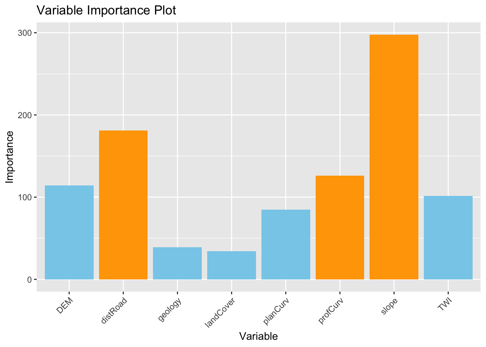
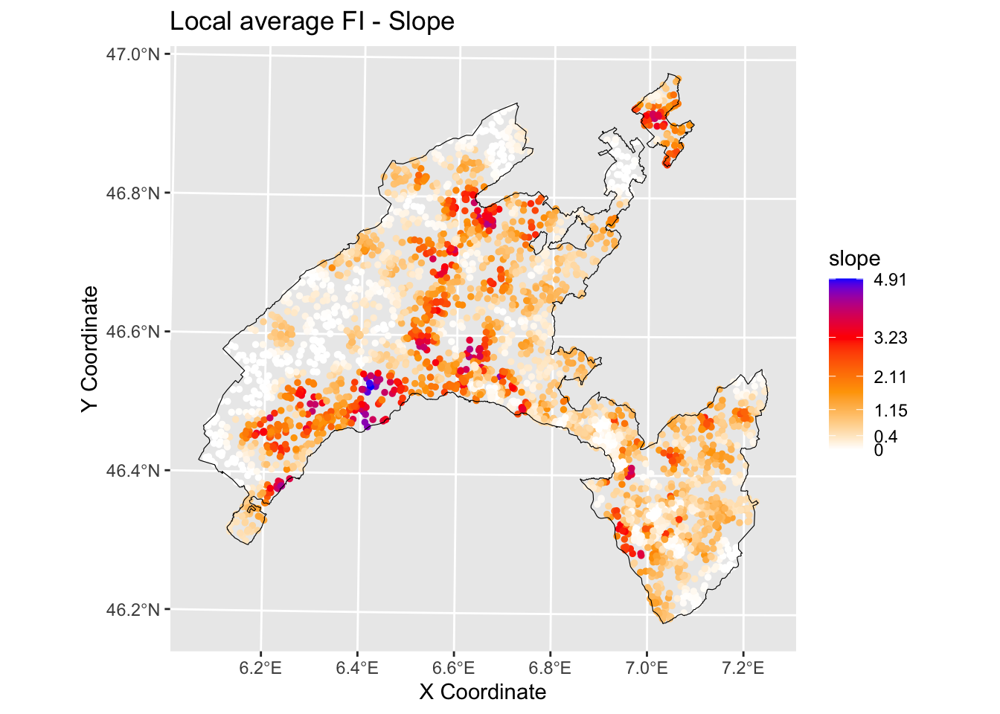
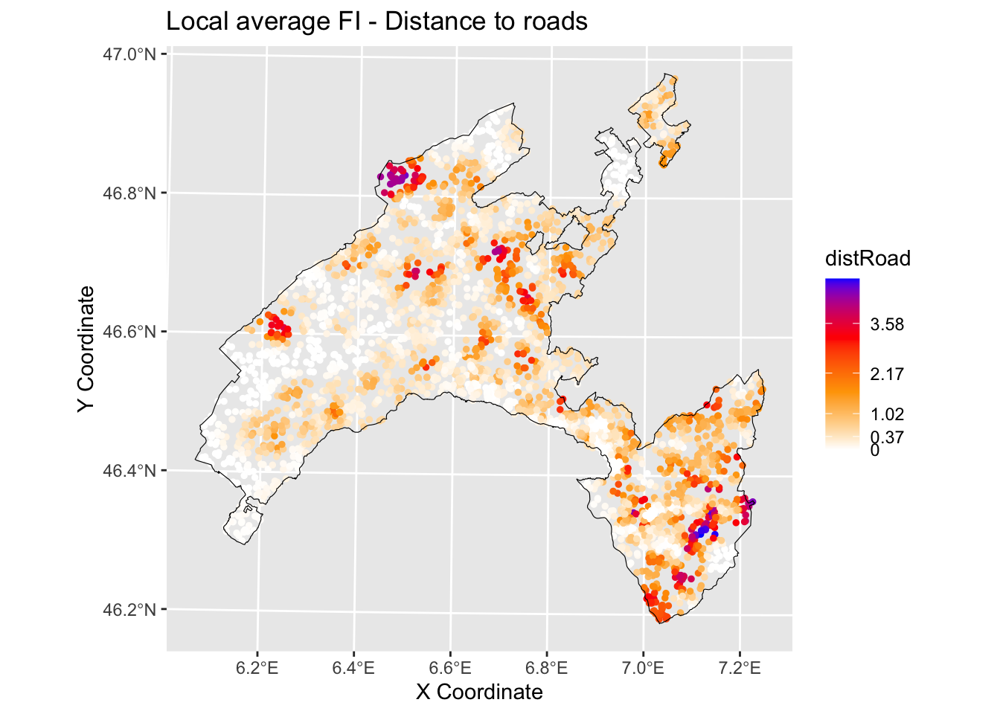
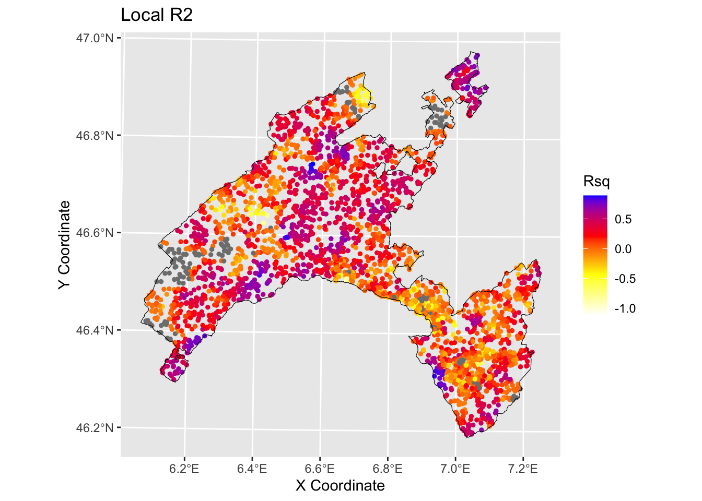

# Interpretability & Explainability in Random Forest

## Introduction

### Basic definations

The distinction between interpretability and explainability lies in their **focus and depth**.

-   *Interpretability* delves into comprehending the inner mechanisms of the algorithm.

-   *Explainability* aims to elucidate the decisions is makes.

**Model complexity:** when dealing with intricate models like Random Forest (with tens of variables and thousands of trees), up to deep neural networks, *interpretability* becomes challenging due to their complexity and the interplay among their components.
In such scenarios, *explainability* proves to be a more practical approach, as it focuses on clarifying decisions rather than delving into the complexities of the model.

**Communication**: in terms of audience and purpose, *interpretability* primarily concerns AI specialists and researchers, whereas *explainability* targets end users seeking to grasp model decisions.
Consequently, explainability necessitates a more straightforward and intuitive communication of information.

### Aim of the present lab

In this exercise you will work with the outputs of Random Forest resulting from the landslides susceptibility map project (LSM_RF).

-   Firstly, we will explore the relative importance of the predictor variables, and then their relative probability of prediction success.

-   Finally we will apply a local version of Random Forest (named Geographical Random Forest) to analyse the spatial heterogeneity of the local variable importance.

### Re-load lybraries and workspace

If you have quit the workspace where you have run the RF model for landslide susceptibility map you need to load it again in this new project.
"*Loading the workspace*" refers to the action of restoring the saved state of the R environment.
When you save your workspace in R, it typically includes all the objects (such as variables, functions, data frames, etc.) that are currently present in your R session.
Loading the workspace means to restore this saved state, bringing back all the previously saved objects into your current R session.


```
##  [1] "RColorBrewer" "tidyr"        "randomForest" "classInt"     "plotROC"     
##  [6] "ggplot2"      "pROC"         "dplyr"        "readr"        "foreign"     
## [11] "terra"        "distill"      "stats"        "graphics"     "grDevices"   
## [16] "utils"        "datasets"     "methods"      "base"
```

## Variable importance plot

Although machine learning algorithms are often considered as a black box, with RF is possible to plot a sample tree (selected randomly) to analyse its structure and investigate how decisions have been made.
In addition RF provides two metrics allowing to assess the importance of each variables in the model: the mean decrease in accuracy (MDA), and the mean decrease in Gini index.
Higher values indicate the most important variables.


``` r
library("party")

x <- ctree(LS~., data=LS_train)
plot(x, type="simple")
```


``` r
# Display the plot with the relative importance of each variable
importance(RF_LS)
varImpPlot(RF_LS)
```


### Partial dependence plot

In addition, the Partial Dependence Plot (PDP) allows to estimate, for each single variable, the relative probability of prediction success over different ranges of values.
It gives a graphical depiction of the marginal effect of each variable on the class probability over different ranges of continuous or discrete values.
Positive values are associated with the probability of occurrence of the phenomena (i.e., landslides presence), while negative vales indicate its absence.


``` r
# Slope
partialPlot(RF_LS, LS_train, x.var = slope, rug = TRUE, 
            which.class = RF_LS$classes[2],xlab= "Slope [°]", 
            main = "", ylab = "PDP")
```


``` r
# Elevation
partialPlot(RF_LS, LS_train ,x.var = DEM, rug = TRUE, 
            which.class = RF_LS$classes[2],xlab= "Elevation [m]", 
            main = "",ylab = "PDP")
```


``` r
# Profile curvature
partialPlot(RF_LS, LS_train, x.var = profCurv, rug = TRUE, 
            which.class = RF_LS$classes[2],xlab= "Profile curvature [1/m]", 
            main = "", ylab = "PDP", xlim = c(-0.1,0.1))
```


``` r
# Plan Curvature
partialPlot(RF_LS, LS_train, x.var = planCurv, rug = TRUE, 
            which.class = RF_LS$classes[2],xlab= "Plan curvature [1/m]", 
            main = "", ylab = "PDP", xlim = c(-0.1,0.1))
```


``` r
# Distance to road
partialPlot(RF_LS, LS_train, x.var = distRoad, rug = TRUE, 
            which.class = RF_LS$classes[2],xlab= "Distance to road [m]", 
            main = "", ylab = "PDP")
```


``` r
# Topographic wetness index
partialPlot(RF_LS, LS_train, x.var = TWI, rug = TRUE, 
            which.class = RF_LS$classes[2],xlab= "TWI [-]", 
            main = "", ylab = "PDP")
```


``` r
# Geology
partialPlot(RF_LS, LS_train, x.var = geology, rug = TRUE, 
            which.class = RF_LS$classes[2],xlab= "Geology", 
            main = "", ylab = "PDP")
```


``` r
# Land cover
partialPlot(RF_LS, LS_train, x.var = landCover, rug = TRUE, 
            which.class = RF_LS$classes[2],xlab= "Land Cover",
            main = "", ylab = "PDP")
```


## Local Random Forest

Standard machine learning algorithms like Random Forest (RF) lack spatial calibration, hindering capturing the spatial non-stationarity in the relationship between a dependent and a set of independent variables.

To account for the spatial heterogeneity (i.e. non-stationarity) when modeling landslides spatial patterns as function of geographical features, in the present work we explore the **local feature importance** of geographical independent predisposing variables on the spatial distribution of landslides in canton Vaud (Switzerland).

We adopted **Geographically Random Forest** (GRF), a spatial analysis method using a local version of RF algorithm [@georganos_forest_2022] .
This is achieved by fitting a sub-model for each observation in space, taking into account the neighbouring observations.
GRF can model the non-stationarity coupled with a non-linear model (RF) which tends not to overfit due to its bootstrapping nature.
In addition it is suited for datasets with numerous predictors.

Essentially, GRF was designed to be a bridge between machine learning and geographical models, combining inferential and explanatory power.

### Run GRF

We will use the last development of **Geographical Random Forest** (GRF) [4].
This function have been implemented for regression problem, so we need to transform our binary response variable (i.e., presence=1 / absence = 0) as a numeric value which can assume a range of values from zero to one.


```
## 'data.frame':	5188 obs. of  11 variables:
##  $ distRoad : num  160.1 55.9 106.1 70.7 125 ...
##  $ DEM      : num  443 451 460 458 463 ...
##  $ landCover: Factor w/ 7 levels "11","15","21",..: 3 1 2 2 3 1 3 3 3 1 ...
##  $ TWI      : num  7.4 8.72 9.08 8.55 8.33 ...
##  $ planCurv : num  -0.000143 0.003633 0.005981 0.006165 0.000217 ...
##  $ profCurv : num  0.013297 -0.006447 0.000381 -0.001675 -0.005383 ...
##  $ slope    : num  20.86 2.91 2.04 3.46 4.32 ...
##  $ geology  : Factor w/ 11 levels "0","1","2","7",..: 8 8 8 8 8 8 8 8 8 8 ...
##  $ x        : num  567887 568087 567912 567962 567812 ...
##  $ y        : num  2e+05 2e+05 2e+05 2e+05 2e+05 ...
##  $ LS       : Factor w/ 2 levels "0","1": 2 2 2 2 2 2 2 2 2 2 ...
```

```
## 'data.frame':	4150 obs. of  12 variables:
##  $ distRoad : num  182 25 90.1 212.1 134.6 ...
##  $ DEM      : num  917 719 662 498 810 ...
##  $ landCover: Factor w/ 7 levels "11","15","21",..: 5 5 1 3 3 3 3 2 5 3 ...
##  $ TWI      : num  8.15 8.47 8.73 15.52 8.98 ...
##  $ planCurv : num  0.000789 0.003464 0.000962 -0.00004 0.000359 ...
##  $ profCurv : num  7.89e-04 -1.17e-02 -7.98e-04 -3.99e-05 -4.42e-04 ...
##  $ slope    : num  28.31 33.15 2.88 1.94 4.49 ...
##  $ geology  : Factor w/ 11 levels "0","1","2","7",..: 7 4 8 2 2 8 8 2 2 8 ...
##  $ x        : num  569837 561612 540062 504862 548312 ...
##  $ y        : num  133062 139887 154237 140712 169212 ...
##  $ LS       : Factor w/ 2 levels "0","1": 2 2 2 1 1 2 2 2 1 1 ...
##  $ LSregr   : num  1 1 1 0 0 1 1 1 0 0 ...
```

```
## 'data.frame':	1038 obs. of  12 variables:
##  $ distRoad : num  90.1 956.9 55.9 70.7 25 ...
##  $ DEM      : num  490 1299 850 480 1338 ...
##  $ landCover: Factor w/ 7 levels "11","15","21",..: 3 5 5 1 3 3 2 3 1 4 ...
##  $ TWI      : num  10.14 9.19 9.74 10.78 10.51 ...
##  $ planCurv : num  0.005263 0.002523 -0.005231 -0.000883 0.001165 ...
##  $ profCurv : num  -0.010737 -0.003077 0.008209 0.000877 0.000685 ...
##  $ slope    : num  12.51 1.82 18.31 5.2 12.48 ...
##  $ geology  : Factor w/ 11 levels "0","1","2","7",..: 8 3 8 2 2 8 2 2 8 5 ...
##  $ x        : num  529962 501762 552912 545262 572112 ...
##  $ y        : num  160712 149912 148212 189712 135962 ...
##  $ LS       : Factor w/ 2 levels "0","1": 2 1 2 1 2 1 2 1 2 1 ...
##  $ LSregr   : num  1 0 1 0 1 0 1 0 1 0 ...
```


``` r
Coords<-LS_train[,9:10] # define coordinates

# Run GRF

set.seed(123) # initialize 

gwRF_LS<-grf(LSregr~distRoad+DEM+landCover+TWI+planCurv+profCurv+slope+geology,  LS_train, bw=40, mtry=3, kernel="adaptive",coords=Coords)
```

```
## Ranger result
## 
## Call:
##  ranger(LSregr ~ distRoad + DEM + landCover + TWI + planCurv +      profCurv + slope + geology, data = LS_train, num.trees = 500,      mtry = 3, importance = "impurity", num.threads = NULL) 
## 
## Type:                             Regression 
## Number of trees:                  500 
## Sample size:                      4150 
## Number of independent variables:  8 
## Mtry:                             3 
## Target node size:                 5 
## Variable importance mode:         impurity 
## Splitrule:                        variance 
## OOB prediction error (MSE):       0.117128 
## R squared (OOB):                  0.5315825 
##  distRoad       DEM landCover       TWI  planCurv  profCurv     slope   geology 
## 181.93889 113.22987  33.98818 101.59075  83.15042 123.31246 302.83349  39.09378 
##     Min.  1st Qu.   Median     Mean  3rd Qu.     Max. 
## -1.00000 -0.03162  0.00000 -0.01882  0.03284  1.00000 
##       Min.    1st Qu.     Median       Mean    3rd Qu.       Max. 
## -0.3981333 -0.0030000  0.0000000 -0.0003047  0.0042917  0.2957333 
##           Min      Max      Mean       StD
## distRoad    0 4.846175 0.6640442 0.8686210
## DEM         0 4.442619 0.7486061 0.7680691
## landCover   0 4.301103 0.1936414 0.3141822
## TWI         0 4.284581 0.6287907 0.6790622
## planCurv    0 3.126327 0.4565076 0.4888202
## profCurv    0 4.048531 0.5832407 0.6300842
## slope       0 4.913916 0.9080469 0.9518115
## geology     0 3.669751 0.2213336 0.4038733
```

``` r
saveRDS(gwRF_LS, "gwRF_LS.rds")
```

### Variable importance plot

#### Global variable importance plot

Based on the results of the GRF, we present a plot of the variable importance ranking for illustrative purposes.
Values came from "Global ML Model Summary" - "Importance.


``` r
# Create a data frame with variable names and importance values
variable_importance <- data.frame (
  Variable = c("distRoad", "DEM", "landCover", "TWI", "planCurv", "profCurv", "slope", "geology"),
  Importance = c(181.18490, 114.32444,  34.23643, 101.51863,  84.81667, 125.93651, 297.74411,  39.22721 ) # Importance - Global ML
)

# Assign different colors to the top three important variables
variable_importance$Color <- ifelse(variable_importance$Importance >= sort(variable_importance$Importance, decreasing = TRUE)[3], "orange", "skyblue")

# Create a bar plot for variable importance with different colors for the top three variables
ggplot(data = variable_importance, aes(x = Variable, y = Importance, fill = Color)) +
  geom_bar(stat = "identity") +
  scale_fill_identity() +
  labs(title = "Variable Importance Plot", x = "Variable", y = "Importance") +
  theme(axis.text.x = element_text(angle = 45, hjust = 1))  # Rotate x-axis labels for better readability
```



#### Local Variable importance

##### Slope


``` r
# Create a data frame with the values of the local variables importance and the coordinates for each location¨
gwRF_LS_var<-gwRF_LS$Local.Variable.Importance
gwRF_LS_var_XY<-cbind(gwRF_LS_var,LS_train$x,LS_train$y ) # add coordinates
colnames(gwRF_LS_var_XY)[9]<- "X" #rename column X-coordinate 
colnames(gwRF_LS_var_XY)[10]<- "Y" #rename column Y-coordinate 
str(gwRF_LS_var_XY) 
```

```
## 'data.frame':	4150 obs. of  10 variables:
##  $ distRoad : num  0.53312 0.00351 0.31458 0.07548 2.46608 ...
##  $ DEM      : num  1.11112 0.00548 0.13488 0.79269 0.66155 ...
##  $ landCover: num  0.1857 0.0072 0.0856 0.6757 0.0124 ...
##  $ TWI      : num  0.2571 0.0425 1.1416 0.2105 0.392 ...
##  $ planCurv : num  0.20406 0.00112 0.12462 0.84817 1.17041 ...
##  $ profCurv : num  0.1011 0.0032 0.2125 1.6097 2.5097 ...
##  $ slope    : num  0.3679 0.0269 0.6325 0.6656 0.9508 ...
##  $ geology  : num  0.078629 0.000606 0.09991 0.572837 0.01066 ...
##  $ X        : num  569837 561612 540062 504862 548312 ...
##  $ Y        : num  133062 139887 154237 140712 169212 ...
```

``` r
library(sf) #for spatial data operations
# Convert vector to sf (simple feature)
Vaud<-vect("data/RF/Vaud_CH.shp")
Vaud_sf<-st_as_sf(Vaud) 

# Output predicted values are transformed to a vector
pred.vect <- as.vector(gwRF_LS_var_XY$slope)

library(classInt) #for classification

brk<-(classIntervals(pred.vect, n=5, style = "fisher"))
brkInt<-round(brk$brks, digits=2)
print(brkInt)
```

```
## [1] 0.00 0.39 1.00 1.81 2.99 4.91
```

``` r
#natural breaks (fisher)

ggplot() +
    geom_point(data = gwRF_LS_var_XY, aes(x = X, y = Y, colour = slope), size = 1) +
    scale_color_gradientn(colors = c("white", "orange","red", "blue"),  
                       breaks = c(0.00, 0.40, 1.15, 2.11, 3.23, 4.91), 
                       labels=c(0.00, 0.40, 1.15, 2.11, 3.23, 4.91)) +
        labs( x = "X Coordinate", y = "Y Coordinate")+
    ggtitle("Local average feature importance")+
    geom_sf(data = Vaud_sf, fill = "transparent", color = "black", size=2) #overlap borders
```



##### Distance to roads


``` r
# Output predicted values are transformed to a vector
pred.vect <- as.vector(gwRF_LS$Local.Variable.Importance$distRoad)
 
brk<-(classIntervals(pred.vect, n=5, style = "fisher"))
brkInt<-round(brk$brks, digits=2)
print(brkInt) # print breaks
```

```
## [1] 0.00 0.36 0.98 2.04 3.33 4.85
```

``` r
#natural breaks (fisher)

ggplot() +
    geom_point(data = gwRF_LS_var_XY, aes(x = X, y = Y, colour = distRoad), size = 1) +
    scale_color_gradientn(colors = c("white", "orange","red", "blue"), 
                       breaks = c(0.00, 0.37, 1.02, 2.17, 3.58, 4.85), 
                       labels=c(0.00, 0.37, 1.02, 2.17, 3.58, 4.85)) +
    labs( x = "X Coordinate", y = "Y Coordinate")+
    ggtitle("Local average feature importance")+
    geom_sf(data = Vaud_sf, fill = "transparent", color = "black", size=2) #overlap borders
```



### Local R squared

The Local R-squared value ranges from 0 to 1 and represents the strength of the correlations of the local model on the features.


``` r
Rsq<-gwRF_LS$LGofFit$LM_Rsq100
Rsq_XY<-as.data.frame(cbind(Rsq,LS_train$x,LS_train$y)) # add coordinates
colnames(Rsq_XY)[2]<- "X"
colnames(Rsq_XY)[3]<- "Y"
str(Rsq_XY)
```

```
## 'data.frame':	4150 obs. of  3 variables:
##  $ Rsq: num  -0.2341 -0.0148 -0.2604 0.2742 0.5882 ...
##  $ X  : num  569837 561612 540062 504862 548312 ...
##  $ Y  : num  133062 139887 154237 140712 169212 ...
```

``` r
ggplot () +
  geom_point(data = Rsq_XY, aes(x = X, y = Y, colour = Rsq), size = 1)+ 
  scale_color_gradientn(colors = c("white", "yellow","red", "blue"))+
  labs(title = "Rsq", x = "X Coordinate", y = "Y Coordinate")+
  ggtitle("Local R2")+
  geom_sf(data = Vaud_sf, fill = "transparent", color = "black", size=2) #overlap borders
```



## Conclusions and further analyses

In the present exercise GRF has been used as a purely exploratory tool to estimate the spatial variation of the relationship between landslides in canton Vaud (Switzerland) and the influencing factors.
It allowed to elaborate maps delineating the local average importance of the most highly correlated features and to visualise the local fitting performance (R2 local value) into a map.

To be sure that everything is perfectly clear for you, we propose you to **answer the following questions** and to discuss your answers with the other participants to the course or directly with the teacher.

1.  Among the following angorithm evaluate them in therms of their interpretability and explainability: Support Vector Machines , linear regression, Deep Learning Models, Decision Trees, K-Nearest Neighbors, Neural Networks, Random Forests, logistic regression.

2.  Which are the three most important variables of your model (based on the MDA)?

3.  What is the slope value (or range of values) that gives the highest probability of landslides occurrence?
    And for the geology, which are the most important classes?

4.  Evaluate the spatial variation of the relationship between landslides and slope / distance to roads in your study area by visually inspecting the local average importance of these features.

5.  You can replicate this code (some chiuncks of it) to evaluate the local average importance of the third most important variable, as well as to map the local mean squared error.
